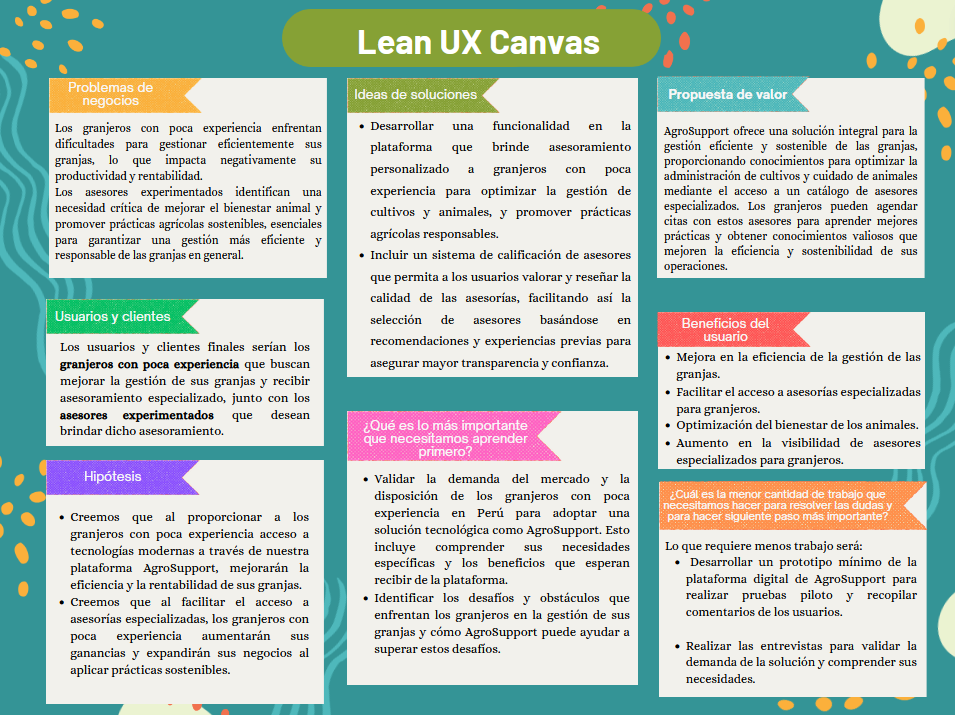
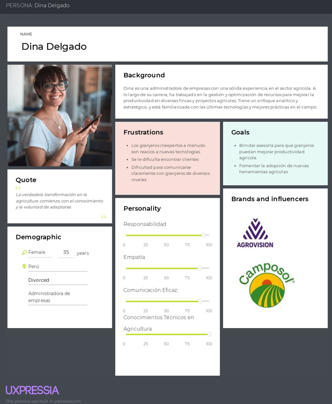
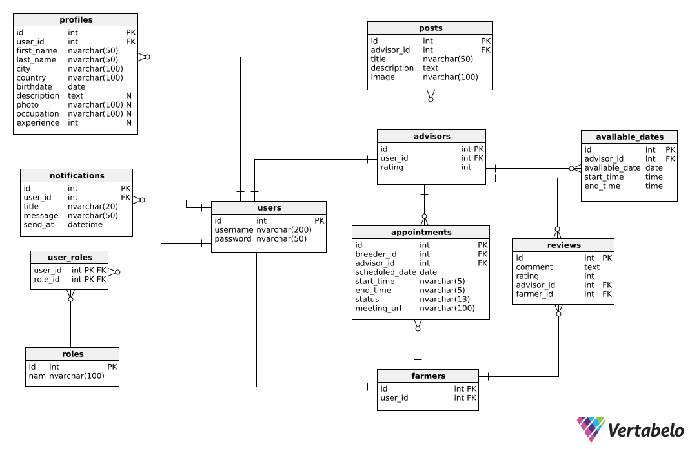

  

  <h1>Universidad Peruana de Ciencias Aplicadas</h1>
  
<strong>Carrera:</strong> Ingeniería de Software

  
<strong>Ciclo:</strong> 2024 - 2

  
<strong>Curso:</strong> Aplicaciones para Dispositivos Móviles

  
<strong>Sección:</strong> SW63

  
<strong>Profesor:</strong> Jorge Luis Mayta Guillermo

  
<strong>"Informe de Trabajo Final"</strong>

  
<strong>Startup:</strong> AgroTech

  
<strong>Producto:</strong> AgroSupport

<table align="center">
  <tr>
    <th>Integrantes</th>
    <th>Código</th>
  </tr>
  <tr>
    <td>Paredes Puente, Sebastián Roberto</td>
    <td>U202217239</td>
  </tr>
  <tr>
    <td>Delgado Corrales, Piero Gonzalo</td>
    <td>U202210749</td>
  </tr>
  <tr>
    <td>Matos Fernandez, Christian Andre</td>
    <td>U202214162</td>
  </tr>
  <tr>
    <td>Salinas Torres, Salvador Antonio</td>
    <td>U20221B127</td>
  </tr>
</table>

<b>Agosto 2024</b>

# Registro de versiones

<table>
  <thead>
    <tr>
        <th>Versión</th>
        <th>Fecha</th>
        <th>Autor</th>
        <th>Descripción de modificación</th>
    </tr>
  </thead>
  <tbody>
  <tr>
      <td><strong>TB1</strong></td>
      <td>29 de agosto</td>
      <td>
        <ul>
          <li>Paredes Puente, Sebastian Roberto</li>
          <li>Delgado Corrales, Piero Gonzalo</li>
          <li>Matos Fernandez, Christian Andre</li>
          <li>Salinas Torres, Salvador Antonio</li>
        </ul>
      </td>
      <td>
        Se ha incluido el avance de los siguientes capítulos:
        <ul>
          <li>Objetivos SMART</li>
          <li>Capítulo 1: Presentación</li>
          <li>Capítulo 2: Needfinding</li>
        </ul>
      </td>
  </tr>
  </tbody>
</table>

# Tabla de Contenido

[Registro de Versiones](#registro-de-versiones)

[Student Outcome](#student-outcome)

[Objetivos SMART](#objetivos-smart)

[Capítulo 1: Presentación](#Capítulo-I-Presentación)
  - [1.1. Startup Profile](#11-startup-profile)
    - [1.1.1. Descripción de la Startup](#111-descripción-de-la-startup)
    - [1.1.2. Perfiles de integrantes del equipo](#112-perfiles-de-integrantes-del-equipo)
  - [1.2. Solution Profile](#12-solution-profile)
    - [1.2.1. Antecedentes y problemática](#121-antecedentes-y-problemática)
    - [1.2.2. Lean UX Process](#122-lean-ux-process)
      - [1.2.2.1. Lean UX Problem Statements](#1221-lean-ux-problem-statements)
      - [1.2.2.2. Lean UX Assumptions](#1222-lean-ux-assumptions)
      - [1.2.2.3. Lean UX Hypothesis Statements](#1223-lean-ux-hypothesis-statements)
      - [1.2.2.4. Lean UX Canvas](#1224-lean-ux-canvas)
  - [1.3. Segmentos objetivo](#13-segmentos-objetivo)

[Capítulo 2: Needfinding](#Capítulo-2-Needfinding)
  - [2.1. Competidores](#21-competidores)
    - [2.1.1. Análisis competitivo](#211-análisis-competitivo)
    - [2.1.2. Estrategias y tácticas frente a competidores](#212-estrategias-y-tácticas-frente-a-competidores)
  - [2.2. Entrevistas](#22-entrevistas)
    - [2.2.1. Diseño de entrevistas](#221-diseño-de-entrevistas)
    - [2.2.2. Registro de entrevistas](#222-registro-de-entrevistas)
    - [2.2.3. Análisis de entrevistas](#223-análisis-de-entrevistas)
  - [2.3. Needfinding](#23-needfinding)
    - [2.3.1. User Personas](#231-user-personas)
    - [2.3.2. User Task Matrix](#232-user-task-matrix)
    - [2.3.3. User Journey Mapping](#233-user-journey-mapping)
    - [2.3.4. Empathy Mapping](#234-empathy-mapping)
    - [2.3.5. As-is Scenario Mapping](#235-as-is-scenario-mapping)
  - [2.4 Requirements Specification](#24-requirements-specification)
    - [2.4.1. To-Be Scenario Mapping](#241-to-be-scenario-mapping)
    - [2.4.2. User Stories](#242-user-stories)
    - [2.4.3. Impact Mapping](#243-impact-mapping)
    - [2.4.4. Product Backlog](#244-product-backlog)

[Capítulo 3: Arquitectura](#Capítulo-3-Arquitectura)
  - [3.1. Product design](#31-product-design)
    - [3.1.1. Style Guidelines](#311-style-guidelines)
      - [3.1.1.1. General Style Guidelines](#3111-general-style-guidelines)
    - [3.1.2. Information Architecture](#312-information-architecture)
      - [3.1.2.1. Organization Systems](#3121-organization-systems)
      - [3.1.2.2. Labelling Systems](#3122-labelling-systems)
      - [3.1.2.3. SEO Tags and Meta Tags](#3123-seo-tags-and-meta-tags)
      - [3.1.2.4. Searching Systems](#3124-searching-systems)
      - [3.1.2.5. Navigation Systems](#3125-navigation-systems)
    - [3.1.3. Landing Page UI Design](#313-landing-page-ui-design)
      - [3.1.3.1. Landing Page Wireframe](#3131-landing-page-wireframe)
      - [3.1.3.2. Landing Page Mock-up](#3132-landing-page-mock-up)
    - [3.1.4. Mobile Applications UX/UI Design](#314-mobile-applications-uxui-design)
      - [3.1.4.1. Mobile Applications Wireframes](#3141-mobile-applications-wireframes)
      - [3.1.4.2. Mobile Applications Wireflow Diagrams](#3142-mobile-applications-wireflow-diagrams)
      - [3.1.4.3. Mobile Applications Mock-ups](#3143-mobile-applications-mock-ups)
      - [3.1.4.4. Mobile Applications User Flow Diagrams](#3144-mobile-applications-user-flow-diagrams)
      - [3.1.4.5. Mobile Applications Prototyping](#3145-mobile-applications-prototyping)
  - [3.2. Architecture Overview](#32-architecture-overview)
    - [3.2.1. Domain-Driven Software Architecture](#321-domain-driven-software-architecture)
      - [3.2.1.1. Software Architecture Context Level Diagram](#3211-software-architecture-context-level-diagram)
      - [3.2.1.2. Software Architecture Container Level Diagram](#3212-software-architecture-container-level-diagram)
      - [3.2.1.3. Software Architecture Components Diagram](#3213-software-architecture-components-diagram)
    - [3.2.2. Software Object-Oriented Design](#322-software-object-oriented-design)
      - [3.2.2.1. Class Diagrams](#3221-class-diagrams)
      - [3.2.2.2. Class Dictionary](#3222-class-dictionary)
      - [3.2.2.3. Database Design](#3223-database-design)
      - [3.2.2.4. Database Diagram](#3224-database-diagram)

[Capítulo 4: Backend Product Implementation & Validation](#Capítulo-4-Backend-Product-Implementation--Validation)
  - [4.1. Software Configuration Management](#41-software-configuration-management)
    - [4.1.1. Software Development Environment Configuration](#411-software-development-environment-configuration)
    - [4.1.2. Source Code Management](#412-source-code-management)
    - [4.1.3. Source Code Style Guide & Conventions](#413-source-code-style-guide--conventions)
    - [4.1.4. Software Deployment Configuration](#414-software-deployment-configuration)
  - [4.2. Software Development & Implementation](#42-software-development--implementation)
    - [4.2.1. Sprint n](#421-sprint-n)
      - [4.2.1.1. Sprint Planning n](#4211-sprint-planning-n)
      - [4.2.1.2. Sprint Backlog n](#4212-sprint-backlog-n)
      - [4.2.1.3. Development Evidence for Sprint Review](#4213-development-evidence-for-sprint-review)
      - [4.2.1.4. Testing Suite Evidence for Sprint Review](#4214-testing-suite-evidence-for-sprint-review)
      - [4.2.1.5. Execution Evidence for Sprint Review](#4215-execution-evidence-for-sprint-review)
      - [4.2.1.6. Services Documentation Evidence for Sprint Review](#4216-services-documentation-evidence-for-sprint-review)
      - [4.2.1.7. Software Deployment Evidence for Sprint Review](#4217-software-deployment-evidence-for-sprint-review)
      - [4.2.1.8. Team Collaboration Insights during Sprint](#4218-team-collaboration-insights-during-sprint)

[Capítulo 5: Product Implementation & Validation](#Capítulo-5-Product-Implementation--Validation)

[Conclusiones](#conclusiones)

[Recomendaciones](#recomendaciones)

[Video App Validation](#video-app-validation)

[Video About the Product](#video-about-the-product)

[Video About the Team](#video-about-the-team)

[Glosario](#glosario)

[Bibliografía](#bibliografía)

# Student Outcome

**ABET – EAC - Student Outcome 7**

**Criterio:** La capacidad de adquirir y aplicar nuevos conocimientos según sea necesario, utilizando estrategias deaprendizaje apropiadas.

<table>
  <thead>
    <tr>
      <th><strong>Criterio específico</strong></th>
      <th><strong>Acciones realizadas</strong></th>
      <th><strong>Conclusiones</strong></th>
    </tr>
  </thead>
  <tbody>
    <tr>
      <td>Actualiza conceptos y conocimientos necesarios para su desarrollo profesional y en especial para su proyecto en soluciones de software.</td>
      <td>
        
<strong>Paredes Puente, Sebastian Roberto</strong>

        
<strong>TB1:</strong> En este primer avance, se identificó la problemática y se realizó la investigación necesaria para definir los requisitos que nuestra aplicación final debe cubrir. Para ello, llevé a cabo entrevistas con personas de nuestros segmentos objetivo para comprender mejor sus principales necesidades y adoptar su perspectiva, asegurándome de que las user stories que planteamos fueran las más adecuadas.

        

        
<strong>Delgado Corrales, Piero Gonzalo</strong>

        
<strong>TB1:</strong> Para esta entrega, se adquirieron nuevos conocimientos en la realización de entrevistas y su análisis ya que se pudo entender mejor las necesidades de los granjeros y asesores. Esto es fundamental para la creación de los User Personas, User Task Matrix, y realizar el User Journey Mapping y nos permitirá .realizar una mejor solución de software.

        

        
<strong>Matos Fernandez, Christian Andre</strong>

        
<strong>TB1:</strong>Para esta entrega, investigamos a los competidores y desarrollamos estrategias para enfrentarlos. Además, realizamos entrevistas, de las cuales obtuvimos la información necesaria para crear las User Stories que serán útiles en el desarrollo de la aplicación.

        

        
<strong>Salinas Torres, Salvador Antonio</strong>

        
<strong>TB1:</strong> En este entregable, definimos el problema inicial sobre el cual partirá nuestra aplicación móvil a realizar. Igualmente, tuvimos que actualizar conocimientos para determinar bien la problemática a través de una investigación sobre el tema y también sobre lo necesario para poder desarrollar la aplicación móvil.

        

      </td>
      <td>
        
<strong>TB1: </strong>

        
En este primer avance del proyecto, cada integrante del equipo ha actualizado y ampliado sus conocimientos esenciales para el desarrollo de soluciones de software, enfocándose en aspectos fundamentales como la investigación de necesidades, la realización y análisis de entrevistas, el estudio de la competencia, y la definición clara de problemáticas. Estos esfuerzos han permitido a todos mejorar su comprensión del mercado objetivo, garantizar que las User Stories y demás herramientas de diseño sean precisas y relevantes, y sentar las bases para el desarrollo de una aplicación móvil que responda adecuadamente a las necesidades identificadas.

      </td>
    </tr>
    <tr>
      <td>Reconoce la necesidad del aprendizaje permanente para el desempeño profesional y el desarrollo de proyectos en soluciones de software.</td>
      <td>
        
<strong>Paredes Puente, Sebastian Roberto</strong>

        
<strong>TB1:</strong> A través de las opiniones recogidas en las entrevistas, entendimos la importancia de un aprendizaje continuo. Esto nos permitió diseñar las funcionalidades del producto definidas en las User Stories, de manera que vayan acorde a las necesidades de nuestros usuarios.

        

        
<strong>Delgado Corrales, Piero Gonzalo</strong>

        
<strong>TB1:</strong> Mediante las opiniones obtenidas de las entrevistas pudimos comprender la necesidad de un aprendizaje continuo porque gracias a estas pudimos diseñar las funcionalidades del producto delimitadas en las User Stories para que se alineen con las necesidades cambiantes de nuestros segmentos objetivos y tomando en cuenta las nuevas tecnologías.

        

        
<strong>Matos Fernandez, Christian Andre</strong>

        
<strong>TB1:</strong>A partir de las entrevistas y del análisis de los datos obtenidos, logramos identificar la importancia de integrar un enfoque de aprendizaje continuo. Esto nos permitió definir las User Stories del producto de manera que se adapten a las demandas reales y cambiantes de nuestros usuarios.

        

        
<strong>Salinas Torres, Salvador Antonio</strong>

        
<strong>TB1:</strong> Se realizó una investigación sobre el tema para verificar de forma clara la necesidad a resolver, así como con fuentes secundarias recuperadas de artículos y fuentes primarias como las entrevistas realizadas.

        

      </td>
      <td>
        
<strong>TB1: </strong>

        
En este primer avance del proyecto, cada integrante del equipo ha reconocido la importancia del aprendizaje continuo en el desarrollo profesional y en la creación de soluciones de software. A través de la investigación, entrevistas y análisis de datos, todos comprendieron que mantenerse actualizados y abiertos a nuevos conocimientos es crucial para diseñar funcionalidades que se alineen con las necesidades cambiantes de los usuarios y con las nuevas tecnologías. Esta actitud proactiva hacia el aprendizaje permitirá al equipo desarrollar un producto que no solo resuelve las problemáticas actuales, sino que también se adapta a futuros desafíos.

      </td>
    </tr>
  </tbody>
</table>

# Objetivos SMART

Los objetivos SMART son una herramienta que permite establecer metas claras y alcanzables. SMART es un acrónimo que significa: Specific (Específico), Measurable (Medible), Achievable (Alcanzable), Relevant (Relevante) y Time-bound (Limitado en el tiempo).

De esta forma, nosotros hemos definido los siguientes objetivos para nuestro producto AgroSupport:

<table>
  <thead>
    <tr>
      <th>Nombre del estudiante</th>
      <th>Descripción del objetivo</th>
      <th>Fecha de inicio</th>
      <th>Fecha de cumplimiento esperada</th>
      <th>¿Qué se va a lograr?</th>
      <th>¿Tiene KPI o métrica clara?</th>
      <th>¿Es retador y va más allá de sus funciones?</th>
      <th>¿Está alineado a la estrategia?</th>
      <th>¿Cuándo se cumplirá?</th>
    </tr>
  </thead>
  <tbody>
    <tr>
      <td>Piero Delgado</td>
      <td>Investigar principios de diseño de interfaces móviles intuitivas para iOS y Android para aplicarlos en la primera versión de nuestra aplicación con el fin de mejorar la usabilidad y experiencia de usuario.</td>
      <td>19/08/2024</td>
      <td>19/10/2024</td>
      <td>Se va a lograr crear un buen diseño de una interfaz móvil intuitiva y fácil de usar para la aplicación, basándose en las mejores prácticas de diseño móvil identificadas a través de la investigación de aplicaciones exitosas en iOS y Android, como también documentación sobre mejores prácticas en videos o libros.</td>
      <td>La métrica será la valoración positiva de la interfaz por parte de los usuarios durante las entrevistas de validación. Se considerará éxito si al menos el 80% de los entrevistados expresan opiniones favorables.</td>
      <td>Requiere una comprensión más profunda del diseño de interfaces móviles, así como la capacidad de aplicar estos conocimientos en la aplicación. Esto supone un reto importante en el desarrollo móvil y va más allá de solo implementación las funcionalidades de la aplicación.</td>
      <td>Está alineado con la estrategia de desarrollar una aplicación que sea no solo funcional, sino también sencilla para que los granjeros puedan utilizarla de forma recurrente.</td>
      <td>Se cumplirá durante el desarrollo de los prototipos de la aplicación móvil y su primera versión.</td>
    </tr>
    <tr>
      <td>Piero Delgado</td>
      <td>Desarrollar un sistema de notificaciones en tiempo real en Flutter para alertar a los granjeros sobre proximas asesorías y otros eventos como actualizaciones.</td>
      <td>19/10/2024</td>
      <td>19/11/2024</td>
      <td>Se logrará la implementación de un sistema de notificaciones en tiempo real que informe a los granjeros sobre eventos importantes, mejorando la comunicación dentro de la aplicación.</td>
      <td>La métrica a considerar será la visualización de las notificaciones en los dispositivos de prueba. Se considerará exitoso si al menos un 95% de las notificaciones enviadas durante las pruebas son recibidas correctamente.</td>
      <td>La integración de este sistema sí implica un desafío ya que se requiere conocimientos en distintas funcionalidades de Flutter como el envío de notificaciones, creación de eventos dentro de la aplicación y conexión con el backend para saber la fecha de las distintas asesorías.</td>
      <td>Está alineado con el alcance del trabajo ya que esta funcionalidad permite mantener a los granjeros informados sobre el estado de sus asesorías.</td>
      <td>El objetivo se cumplirá al terminar la implementación de la primera versión de la aplicación con Flutter.</td>
    </tr>
    <tr>
      <td>Salvador Salinas</td>
      <td>Implementar una aplicación que sea capaz de utilizar la autenticación de forma segura y adecuada (IAM), de forma que los datos ingresados por los usuarios a través de la aplicación móvil siempre se encuentren protegidos.</td>
      <td>20/08/2024</td>
      <td>26/09/2024</td>
      <td>Se logrará la implementación segura del backend de la aplicación móvil utilizando la autenticación para los usuarios, ya sea administrador o cliente, a través de un sistema IAM el cual sea totalmente compatible con el Frontend de la aplicación móvil.</td>
      <td>La métrica a tomar en cuenta es la cantidad de intentos que toma acceder con un usuario existente a la aplicación móvil, ya que debe comprobar que las credenciales sean las correctas en un 100% de las veces.</td>
      <td>La implementación del sistema de IAM implica retos para realizar buenas prácticas, ya que a pesar de que ya tenemos algo de conocimiento para poder realizarlo, igualmente falta investigación para poder hacerlo de la manera correcta.</td>
      <td>Está alineado con el alcance del trabajo, ya que es esencial entregar una aplicación móvil que funcione de forma segura para los usuarios.</td>
      <td>El objetivo será cumplido al terminar la implementación del backend y conectarlo con el Frontend de la aplicación móvil.</td>
    </tr>
    <tr>
      <td>Salvador Salinas</td>
      <td>Integrar un sistema externo de videoconferencias para los asesoramientos programados para los usuarios.</td>
      <td>20/10/2024</td>
      <td>20/11/2024</td>
      <td>El logro de este objetivo es implementar y configurar un sistema de videoconferencia externo que permita a los usuarios llevar a cabo los asesoramientos a través de la aplicación móvil.</td>
      <td>Para medir si este objetivo llegó a cumplirse, será haciendo la prueba de creación de videoconferencias dentro de la aplicación. Para ello, se considerará que las videoconferencias se creen y se pueda acceder a ellas un 100% de las pruebas. Es importante que siempre funcione ya que esta funcionalidad es lo que brinda el mayor valor a nuestra aplicación.</td>
      <td>La integración de un sistema externo para videoconferencias si se considera retador, ya que es importante encontrar una API robusta y con soporte técnico disponible, así como debe tener alta compatibilidad para la implementación de la aplicación y para los dispositivos móviles desde los cuales se podrá acceder.</td>
      <td>La integración del sistema para videoconferencias es crucial para la aplicación, ya que es la principal funcionalidad que ofrecemos a nuestros segmentos objetivo.</td>
      <td>Se espera que este objetivo sea cumplido al terminar la implementación de la primera versión de la aplicación móvil. En caso no sea así, se espera que sea hasta antes de finalizar el mes de noviembre.</td>
    </tr>
    <tr>
      <td>Sebastian Paredes</td>
      <td>Desarrollar y desplegar una API RESTful segura y escalable para manejar las operaciones CRUD de los datos de usuarios, asegurando que la API soporte varias solicitudes simultáneas sin afectar el rendimiento.</td>
      <td>30/08/2024</td>
      <td>20/09/2024</td>
      <td>Se logrará la implementación de una API RESTful que maneje de manera eficiente las operaciones CRUD (Create, Read, Update, Delete) de los datos de usuarios. La API estará diseñada para ser segura y escalable, garantizando que pueda manejar múltiples solicitudes simultáneas sin comprometer el rendimiento.</td>
      <td>Sí, las métricas clave incluyen el tiempo de respuesta de la API, la capacidad de soportar al menos 100 solicitudes concurrentes sin degradar el rendimiento.</td>
      <td>Este objetivo es retador porque requiere un diseño arquitectónico robusto y la implementación de prácticas avanzadas de seguridad y escalabilidad. Además, implica pruebas exhaustivas bajo condiciones de carga para asegurar que la API mantenga su rendimiento, lo que va más allá de la simple creación de endpoints CRUD.</td>
      <td>Está alineado con la estrategia de asegurar que AgroSupport sea una plataforma confiable y segura, capaz de escalar a medida que aumenta el número de usuarios y la complejidad de las operaciones, garantizando así la continuidad y crecimiento del servicio.</td>
      <td>El objetivo se cumplirá al desplegar la API en un entorno de producción, después de haber pasado pruebas de carga y seguridad, y una vez que se haya demostrado que cumple con las métricas definidas.</td>
    </tr>
    <tr>
      <td>Sebastian Paredes</td>
      <td>Diseñar y desarrollar la vista para nuestro segmento objetivo "Granjero" en la aplicación, asegurando que ambas interfaces vayan acorde a las necesidades de nuestro usuario.</td>
      <td>20/08/2024</td>
      <td>30/09/2024</td>
      <td>Se logrará diseñar y desarrollar una vista específica para el segmento objetivo "Granjero" en la aplicación AgroSupport, que esté alineada con las necesidades y expectativas de los usuarios granjeros. La interfaz estará optimizada para ser intuitiva y fácil de usar, facilitando el acceso a las funcionalidades y servicios relevantes para ellos.</td>
      <td>Sí, las métricas clave incluyen la satisfacción del usuario medida a través de encuestas, donde se buscará que al menos el 85% de los granjeros indiquen que la interfaz es fácil de usar y cumple con sus necesidades.</td>
      <td>Este objetivo es retador porque implica comprender a fondo las necesidades de los granjeros y traducir esas necesidades en un diseño de interfaz efectivo y funcional.</td>
      <td>Está alineado con la estrategia de AgroSupport de proporcionar una experiencia de usuario personalizada y efectiva, adaptada a las necesidades específicas del segmento de granjeros. Esto es crucial para mejorar la adopción y el uso de la aplicación por parte de este grupo objetivo.</td>
      <td>El objetivo se cumplirá al finalizar el diseño y desarrollo de la vista para granjeros y tras recibir retroalimentación positiva en pruebas de usabilidad y satisfacción de los usuarios.</td>
    </tr>
    <tr>
      <td>Christian Matos</td>
      <td>Desarrollar una funcionalidad de búsqueda avanzada en la aplicación que permita a los granjeros con poca experiencia encontrar y conectar con especialistas en áreas específicas de gestión de granjas.</td>
      <td>01/09/2024</td>
      <td>10/10/2024</td>
      <td>Se logrará implementar una funcionalidad de búsqueda avanzada que permita a los granjeros identificar y conectar con asesores especializados en áreas específicas de gestión de granjas. Esta funcionalidad mejorará el acceso a asesoramiento experto, adaptado a las necesidades individuales de los usuarios, facilitando la gestión de granjas y promoviendo prácticas sostenibles.</td>
      <td>La métrica clave será la capacidad del sistema para ofrecer recomendaciones precisas y relevantes a los granjeros, con un objetivo de que al menos el 85% de los usuarios encuentren a un asesor adecuado en menos de 5 minutos de búsqueda, y que al menos el 90% de los usuarios evaluados estén satisfechos con las recomendaciones recibidas.</td>
      <td>Este objetivo es retador porque requiere la implementación de un sistema de filtrado y recomendación avanzado que considere la experiencia y las necesidades específicas de cada usuario, garantizando la relevancia y efectividad de las conexiones con los asesores.</td>
      <td>Está alineado con la misión de AgroTech de brindar acceso fácil a asesoría especializada y con la visión de mejorar la gestión de granjas mediante la conexión efectiva entre granjeros y expertos.</td>
      <td>El objetivo se cumplirá al desplegar la funcionalidad de búsqueda avanzada en AgroSupport y tras la evaluación de su eficacia en conectar granjeros con especialistas, utilizando métricas de satisfacción del usuario y tiempo de conexión para asegurar su éxito.</td>
    </tr>
    <tr>
      <td>Christian Matos</td>
      <td>Optimizar el rendimiento de la aplicación AgroSupport para asegurar tiempos de respuesta de menos de 2 segundos en el 95% de las solicitudes de usuario. Esto incluirá la implementación de técnicas de caching, la optimización de consultas a la base de datos y la mejora del código de backend. El objetivo es completar la optimización y realizar pruebas de carga que demuestren que al menos el 95% de las solicitudes cumplen con el tiempo de respuesta objetivo antes del lanzamiento de la aplicación.</td>
      <td>15/09/2024</td>
      <td>10/10/2024</td>
      <td>Se logrará optimizar el rendimiento de AgroSupport para que el 95% de las solicitudes de usuario tengan tiempos de respuesta de menos de 2 segundos. Esto se alcanzará mediante la implementación de técnicas de caching, optimización de consultas a la base de datos y mejoras en el código de backend. Además, se realizarán pruebas de carga para verificar que se cumpla el objetivo.</td>
      <td>Las métricas clave incluyen el tiempo de respuesta de las solicitudes (menos de 2 segundos para el 95% de las solicitudes) y los resultados de las pruebas de carga que confirmen que la aplicación cumple con este estándar de rendimiento.</td>
      <td>Este objetivo es retador porque requiere la implementación de varias técnicas de optimización y la validación del rendimiento bajo condiciones de carga, lo que implica un enfoque integral para mejorar la eficiencia de la aplicación.</td>
      <td>Está alineado con la visión de AgroTech de ofrecer una aplicación eficiente y ágil, asegurando que los usuarios tengan una experiencia de uso fluida y rápida, lo cual es esencial para la adopción y satisfacción del usuario.</td>
      <td>El objetivo se cumplirá al optimizar el rendimiento de la aplicación, realizar pruebas de carga que confirmen que el 95% de las solicitudes tienen tiempos de respuesta de menos de 2 segundos, y ajustar las optimizaciones según los resultados obtenidos.</td>
    </tr>
  </tbody>
</table>

# Capítulo 1: Presentación

## 1.1. Startup Profile

### 1.1.1. Descripción de la Startup

Nuestra startup se llama AgroTech, y se especializa en abordar los desafíos de la gestión de granjas a través de nuestra aplicación integral AgroSupport. Nuestro enfoque principal es proporcionar asesoramiento especializado y herramientas tecnológicas para mejorar la gestión de granjas de manera inteligente y eficiente.

**Misión:**
Brindar a los granjeros acceso fácil y directo a asesoría especializada, promoviendo prácticas agrícolas sostenibles y modernas para mejorar la productividad, la rentabilidad y el bienestar de las comunidades agropecuarias.

**Visión:**
Liderar la innovación tecnológica para el sector agropecuario, promoviendo el bienestar animal y la sostenibilidad a través de tecnología accesible.

**Logo de AgroSupport**

  

_Imagen 1. Logo de AgroSupport_

### 1.1.2. Perfiles de integrantes del equipo

<table>
  <tr>
    <th>
      
    </th>
    <td valign="top">
      
<b>Paredes Puente, Sebastian Roberto</b>

      

        Soy estudiante de sexto ciclo de la carrera de Ingeniería de Software. Dentro de mi experiencia, destaco la capacidad de analizar información y programar en lenguaje C++. Además, he completado cursos en Python, SQL Server y HTML. En cuanto a mis habilidades interpersonales, cuento con adaptabilidad, pensamiento creativo, trabajo en equipo, gestión del tiempo y capacidad analítica para resolver problemas.
      

    </td>
  </tr>
  <tr>
    <th>
      
    </th>
    <td valign="top">
      
<b>Delgado Corrales, Piero Gonzalo</b>

      

        Actualmente estoy en el sexto ciclo de Ingeniería de Software. Tengo conocimientos en diseño web utilizando HTML, CSS. Además, de utilizar herramientas como Figma para la creación de prototipos. Asimismo, recientemente he aprendido a trabajar con frameworks para frontend (Vue y Angular) y backend (Spring Boot con Java y .NET con C#).  
        Soy una persona responsable y me esfuerzo por mantener una organización óptima para gestionar eficazmente las entregas de trabajos.
      

    </td>
  </tr>
    <tr>
    <th>
      
    </th>
    <td valign="top">
      
<b>Matos Fernandez, Christian Andre</b>

      

        Me llamo Christian Matos, y estoy en mi sexto ciclo de Ingeniería de Software. Poseo experiencia en programación en lenguajes como Python, C++, y JavaScript. Disfruto contribuir con mis habilidades y trabajar en equipo para alcanzar nuestros objetivos comunes.
      

    </td>
  </tr>
  <tr>
    <th>
      
    </th>
    <td valign="top">
      
<b>Salinas Torres, Salvador Antonio</b>

      

        Soy estudiante de sexto ciclo de la carrera de Ingeniería de Software. Poseo conocimientos en programación orientada a objetos en C++, Python, C# y Java; desarrollo de Frontend con frameworks de Angular y Vue; gestión de base de datos en SQL Server, MySQL y SQLite. Considero que soy una persona responsable y siempre organizo el tiempo para hacerlos tranquilamente antes de la fecha de entrega.
      

    </td>
  </tr>
</table>

## 1.2. Solution Profile

### 1.2.1 Antecedentes y problemática

**5 W's**

**What:** Una parte del sector agropecuario suele enfrentar desafíos en la gestión eficiente de las granjas, la falta de acceso a tecnologías adecuadas y la necesidad de mejorar el bienestar animal y la sostenibilidad de las prácticas agrícolas.

**Where:** Se tomará en cuenta todo el Perú, especialmente en las regiones donde se concentra la mayor parte del comercio y la actividad económica del país.

**When:** Actualmente, el sector agropecuario se enfrenta a estos desafíos en la gestión de granjas. Con el crecimiento de la población en el país y la demanda de alimentos en aumento, se requiere una mayor eficiencia en la producción agrícola. Además, las preocupaciones ambientales y de bienestar animal están impulsando la necesidad de adoptar prácticas agrícolas más sostenibles y éticas.

**Who:** Como principales usuarios contamos con los granjeros, quienes son los beneficiarios directos de estas soluciones, asegurando que se adapten a sus necesidades y realidades específicas. Por otro lado, contamos con asesores expertos en la gestión de granja, quienes aportan su conocimiento especializado para desarrollar soluciones tecnológicas específicas y efectivas.

**Why:** Para abordar estos desafíos y mejorar la gestión y productividad en las granjas, es importante garantizar el bienestar animal y promover las prácticas sostenibles en la industria agropecuaria. Igualmente, se busca mejorar la rentabilidad de los agricultores y contribuir a la seguridad alimentaria peruana.

**2 H's**

**How:** A través de la aplicación móvil AgroSupport, se proporcionará asesoramiento especializado para ayudar a los granjeros a gestionar de manera inteligente y eficiente las granjas. De esta forma, apoyaremos a aumentar su producción y por consiguiente su rentabilidad.

**How much:** Se espera que la aplicación tenga un impacto significativo en la mejora de la gestión de las granjas, aumentando de la productividad y promoviendo prácticas más sostenibles en la industria agropecuaria.

Según un informe realizado (Ames, 2022), se ha identificado que el sector agropecuario agrupa alrededor de un cuarto de los empleos del país, aproximadamente un 27.5% de la población. No obstante, se identificó que solo aporta un 5.2% al PBI. Esto indica que la productividad de la agricultura peruana es baja en comparación con otros países de la región, lo que se traduce en una menor rentabilidad para los agricultores y una mayor vulnerabilidad frente a los cambios climáticos y los mercados internacionales.

### 1.2.2 Lean UX Process.

#### 1.2.2.1. Lean UX Problem Statements.

**Problem Statement 1**
<table>
    <tr>
        <td><strong>Nuestro producto tiene como objetivo mejorar la gestión de granjas en el Perú.</strong></td>
    </tr>
    <tr>
        <td>Hemos observado que los granjeros en Perú enfrentan dificultades para gestionar eficientemente sus granjas, lo que afecta su productividad y rentabilidad.</td>
    </tr>
    <tr>
        <td>¿Podría nuestra aplicación AgroSupport ayudar a los granjeros a mejorar la gestión de sus granjas y aumentar su productividad?</td>
    </tr>
</table>

**Problem Statement 2**
<table>
    <tr>
        <td><strong>Nuestro producto tiene como objetivo aumentar la rentabilidad de los granjeros en Perú.</strong></td>
    </tr>
    <tr>
        <td>Hemos observado que muchos granjeros en Perú enfrentan desafíos para lograr una rentabilidad adecuada debido a la falta de eficiencia en la gestión de sus granjas.</td>
    </tr>
    <tr>
        <td>¿Podría AgroSupport ayudar a los granjeros en Perú a mejorar su rentabilidad mediante una gestión más eficiente de sus granjas?</td>
    </tr>
</table>

**Problem Statement 3**
<table>
    <tr>
        <td><strong>Nuestro producto tiene como objetivo proporcionar asesoramiento especializado a los granjeros en Perú.</strong></td>
    </tr>
    <tr>
        <td>Hemos observado que muchos granjeros en Perú enfrentan desafíos para obtener asesoramiento adecuado y especializado en la gestión de sus granjas.</td>
    </tr>
    <tr>
        <td>¿Cómo podría AgroSupport ayudar a los granjeros en Perú a acceder a asesorías especializadas para mejorar la gestión de sus granjas?</td>
    </tr>
</table>

#### 1.2.2.2. Lean UX Assumptions.

**1. ¿Quién es el usuario?**

El usuario principal es el agricultor con poca experiencia, quien se beneficiará directamente del apoyo de los asesores experimentados que utilizan la plataforma para guiarlo en la gestión eficiente de su granja. AgroSupport facilita la adopción de prácticas sostenibles y la mejora de la productividad en el sector agropecuario.

**2. ¿Dónde encaja nuestro producto en su trabajo o vida?**

Nuestro producto se integra en la vida del agricultor al ofrecer asesoramiento especializado para mejorar la gestión de sus operaciones agropecuarias. AgroSupport se incorpora a su trabajo diario proporcionando soluciones para una gestión eficiente, la mejora del bienestar de los animales y cultivos, la adopción de prácticas sostenibles y la comercialización de sus productos.

**3. ¿Qué problemas tiene nuestro producto? ¿Resolver?**

El sector agropecuario enfrenta numerosos desafíos, como la falta de conocimientos técnicos y el acceso insuficiente a asesoramiento especializado. Estos obstáculos impactan negativamente a los granjeros, dificultando la implementación de prácticas esenciales como el manejo adecuado de suelos, la optimización del uso de agua y fertilizantes, y el control eficiente de plagas y enfermedades. La consecuencia es una menor productividad, mayores costos operativos, y un riesgo elevado para la sostenibilidad de las granjas. Esto no solo afecta la rentabilidad de los granjeros, sino que también contribuye a una baja en la productividad agrícola a nivel nacional, impactando negativamente el Producto Bruto Interno (PBI) del país y limitando su capacidad para competir en mercados internacionales.

**4. ¿Cuándo y cómo es nuestro producto? ¿Usado?**

La plataforma es una herramienta esencial para mejorar la eficiencia operativa, obtener asesoramiento especializado en tiempo real, y aplicar prácticas sostenibles que optimicen la productividad y rentabilidad de las granjas. AgroSupport se utilizaría por granjeros con poca experiencia en la gestión diaria de sus granjas. El producto estaría diseñado para ser accesible en dispositivos móviles y computadoras, permitiendo a los granjeros y asesores experimentados usarlo a cualquier hora. 

**5. ¿Qué características son importantes?**

Asesoramiento especializado: Ofrecer información y recomendaciones específicas para la gestión de granjas. 

Herramientas de gestión: Facilitar la administración de inventarios, registros de salud y reproducción, y planificación de actividades.

Conexión con mercados: Ayudar a los granjeros con poca experiencia a acceder a mercados y promocionar sus productos nutricionales de manera efectiva. 

**6. ¿Cómo debe verse nuestro producto y cómo comportarse?**

Nuestro producto debe tener una interfaz fácil de usar, con un diseño llamativo. Debe comportarse de manera rápida, brindando información y recomendaciones de manera clara y precisa. Debe ser seguro, garantizando la protección de los datos de los usuarios.

Presentación de otros supuestos:

<table border="1">
  <tr>
    <td>Considero que mis clientes necesitan un servicio que ofrezca soluciones integrales para la gestión eficiente de sus actividades agropecuarias, abordando aspectos clave como la salud y nutrición de los cultivos y animales, la reproducción y la comercialización. Generaré ingresos a través de la venta de suscripciones a nuestra plataforma AgroSupport.</td>
    <td>Estas necesidades se pueden resolver con tecnologías avanzadas de monitoreo y análisis de datos, junto con el acceso a un equipo de expertos en el sector agropecuario que proporcionen orientación y recomendaciones personalizadas.</td>
  </tr>
  <tr>
    <td>Mi competencia principal en el mercado será BestFarm.</td>
    <td>Mis clientes iniciales pertenecen al sector agropecuario en Perú que buscan mejorar la eficiencia y la rentabilidad de sus operaciones.</td>
  </tr>
  <tr>
    <td>Superaremos los desafíos del sector agropecuario gracias a nuestra aplicación, que conecta a asesores experimentados con personas inexpertas, proporcionando conocimientos especializados y un enfoque centrado en las necesidades específicas en las diversas áreas agropecuarias.</td>
    <td>El principal valor que un cliente busca en mi servicio es mejorar la rentabilidad de su granja agropecuaria, garantizando al mismo tiempo el bienestar de los animales y/o cultivos, y adoptando prácticas sostenibles.</td>
  </tr>
  <tr>
    <td>El mayor riesgo para mi producto es la resistencia al cambio por parte de algunos agricultores, que podrían mostrarse reacios a adoptar nuevas metodologías de trabajo.</td>
    <td>El cliente también puede optar por no renovar su suscripción a nuestra plataforma si no percibe mejoras significativas en la gestión y rentabilidad de su granja.</td>
  </tr>
  <tr>
    <td>Resolveremos esto a través de una estrategia integral de educación y soporte continuo para nuestros clientes, demostrando el valor tangible de nuestra plataforma a través de casos de éxito y resultados demostrables.</td>
    <td>Voy a adquirir a la mayoría de mis clientes a través de campañas de marketing dirigidas en línea, participación en eventos agrícolas locales y asociaciones con organizaciones del sector agropecuario.</td>
  </tr>
  <tr>
    <td>Nuestro enfoque principal es brindar asesoramiento especializado para optimizar la gestión agropecuaria, utilizando soluciones inteligentes y eficientes que maximicen el rendimiento y la sostenibilidad.</td>
  </tr>
</table>

#### 1.2.2.3. Lean UX Hypothesis Statements

**Hypothesis Statement 1**

| Creemos que al proporcionar a los granjeros con poca experiencia en Perú acceso a tecnologías avanzadas y asesoramiento especializado a través de AgroSupport, se mejorará la eficiencia y la rentabilidad de sus granjas. |
| - |
| Sabremos que esto es cierto… |
| Cuando se observe un incremento del 20% en la cantidad de solicitudes de asesoría durante los primeros 6 meses tras el lanzamiento. |

**Hypothesis Statement 2**

| Creemos que al promover prácticas agrícolas sostenibles y éticas en el sector agropecuario en Perú a través de AgroSupport, los agricultores adoptarán un enfoque más responsable hacia el medio ambiente.|
| - |
| Sabremos que esto es cierto… |
| Cuando proporcionemos orientación y recursos específicos sobre prácticas sostenibles a través de AgroSupport y evaluemos la adopción de estas prácticas, viendo un aumento del 15% en el uso de prácticas sostenibles dentro de los primeros 6 meses de lanzamiento. |

**Hypothesis Statement 3**

| Creemos que al incentivar a los asesores con una nueva estructura de comisiones en AgroSupport, se incrementará el número de asesores activos y su satisfacción. |
| - |
| Sabremos que esto es cierto… |
| Cuando se observe un aumento del 20% en el número de asesores activos en los primeros tres meses posteriores a la implementación de la nueva estructura de comisiones. Además, mediremos la retroalimentación de los asesores mediante encuestas regulares, y consideraremos que hemos tenido éxito si al menos el 70% de las respuestas son positivas en relación con la nueva estructura de comisiones. |

#### 1.2.2.4. Lean UX Canvas.

_Imagen 2. Lean UX Canvas_

## 1.3. Segmentos objetivo

**1. Granjeros con poca experiencia**

Los granjeros con poca experiencia en Perú enfrentan dificultades significativas para gestionar sus granjas de manera eficiente debido a la falta de conocimientos técnicos y recursos adecuados. Estos desafíos se traducen en una menor productividad y mayores costos operativos, afectando negativamente su rentabilidad y la sostenibilidad de sus prácticas agrícolas. AgroSupport está diseñado específicamente para abordar estas necesidades al proporcionarles herramientas tecnológicas avanzadas y asesoramiento especializado, facilitando la implementación de prácticas eficientes y sostenibles. Con el apoyo de la plataforma, estos granjeros pueden mejorar la gestión de sus granjas, optimizar el uso de recursos, y aumentar su rentabilidad, contribuyendo a una agricultura más productiva y sostenible en el país.

|**Segmento objetivo**|Granjeros con poca experiencia|
| :- | :- |
|**Edad**|18-40 años|
|**Ubicación**|Perú|
|**Sexo**|Masculino y Femenino|
|**Formación educativa**|Educación primaria|
|**Poder adquisitivo**|Bajo y medio|

**2. Asesores experimentados**

Los asesores experimentados desempeñan un papel crucial en el sector agropecuario peruano, ya que su experiencia y conocimiento son esenciales para ayudar a los pequeños y medianos productores a superar desafíos técnicos y operativos. Estos asesores brindan orientación valiosa en la gestión de granjas, la implementación de prácticas sostenibles y la optimización de procesos productivos. AgroSupport les ofrece una plataforma para ampliar su alcance y efectividad, conectándolos con productores que necesitan su experiencia. A través de la plataforma, los asesores pueden gestionar y coordinar sus asesorías de manera más eficiente, adaptándose a las necesidades específicas de cada productor. Esta colaboración mejora no solo la productividad y sostenibilidad de las unidades agropecuarias, sino que también refuerza el papel de los asesores como facilitadores clave en el desarrollo del sector.

|**Segmento objetivo**|Asesores experimentados|
| :- | :- |
|**Edad**|22-60 años|
|**Ubicación**|Perú|
|**Sexo**|Masculino y Femenino|
|**Formación educativa**|Universitario o cualquier educación superior|
|**Poder adquisitivo**|Bajo, medio y alto|

# Capítulo 2: Needfinding

## 2.1. Competidores

### 2.1.1. Análisis competitivo

<table>
   <tr>
      <th colspan="6" valign="top"><b>Competitive Analysis Landscape</b></th>
   </tr>
   <tr>
      <td rowspan="2" valign="top">¿Por qué llevar a cabo este análisis? </td>
     <td colspan="5" valign="top">
      <ul>
        <li>Objetivo 1: Obtener información sobre las ofertas de nuestros competidores y aprender de las áreas en las que tienen limitaciones.</li>
        <li>Objetivo 2: Reconocer las fortalezas y debilidades de nuestros competidores para desarrollar una estrategia competitiva robusta y eficaz.</li>
      </ul>
     </td>

   </tr>
   <tr></tr>
   <tr>
      <td colspan="2" valign="top">(En la cabecera colocar por cada competidor nombre y logo)</td>
      <td valign="top">
         
AgroSupport

         

      </td>
      <td valign="top">
         
BestFarm

         

      </td>
      <td valign="top">
         
AgriWebb

         

      </td>
      <td valign="top">
         
Trimble Ag 

         

      </td>
   </tr>
   <tr>
      <td rowspan="2">Perfil</td>
      <td valign="top">Overview</td>
      <td valign="top"><b>AgroSupport</b> es una aplicación integral que proporciona asesoramiento especializado y herramientas tecnológicas para mejorar la gestión de granjas de manera eficiente y sostenible</td>
      <td valign="top"><b>BestFarm</b> es una plataforma digital diseñada para la gestión integral de granjas agrícolas y ganaderas. Ofrece herramientas para la planificación de cultivos, gestión de recursos, y monitoreo del ganado, todo accesible desde dispositivos móviles</td>
      <td valign="top"><b>AgriWebb</b> es una plataforma digital que ofrece una solución integral para la gestión de granjas, con un enfoque especial en la trazabilidad del ganado y la optimización de la productividad agrícola</td>
      <td valign="top"><b>Trimble Ag</b> ofrece soluciones avanzadas para la gestión de fincas, incluyendo herramientas para la planificación de cultivos, gestión del ganado, y monitoreo de recursos. </td>
   </tr>
   <tr>
      <td valign="top">
         
Ventaja competitiva

         
¿Qué valor ofrece a los clientes?

      </td>
      <td valign="top"><b>AgroSupport</b> ofrece una vía accesible que vincula a granjeros con poca experiencia con especialistas, permitiendo un asesoramiento experto que mejora la gestión de granjas, fomenta prácticas sostenibles y aumenta la productividad</td>
      <td valign="top"><b>BestFarm</b> se destaca por su enfoque en la simplicidad y accesibilidad, permitiendo a los usuarios gestionar tanto cultivos como ganado en una sola plataforma</td>
      <td valign="top">La ventaja de <b>AgriWebb</b> Se distingue por su fuerte enfoque en la trazabilidad y la capacidad de capturar datos en tiempo real</td>
      <td valign="top"><b>Trimble Ag</b> se destaca por su tecnología avanzada y su capacidad para integrar datos de múltiples fuentes, proporcionando una visión completa y precisa de las operaciones de la finca</td>
   </tr>
   <tr>
      <td rowspan="2">Perfil de Marketing</td>
      <td valign="top">Mercado objetivo</td>
      <td valign="top">El mercado objetivo de <b>AgroSupport</b> son los granjeros con poca experiencia y aquellos que buscan mejorar la gestión de sus granjas</td>
      <td valign="top">El mercado objetivo de <b>BestFarm</b> son los agricultores y ganaderos que buscan una solución unificada para la gestión de todas las operaciones de su finca</td>
      <td valign="top">El mercado objetivo de <b>AgriWebb</b> son ganaderos y agricultores que buscan mejorar la eficiencia y la trazabilidad de sus operaciones</td>
      <td valign="top">El mercado objetivo de <b>Trimble Ag</b> son agricultores y ganaderos de tamaño medio a grande que buscan soluciones integradas para la gestión de sus operaciones</td>
   </tr>
   <tr>
      <td valign="top">Estrategias de marketing</td>
      <td valign="top">Las estrategias que utilizan <b>AgroSupport</b> son marketing digital dirigido a granjeros, colaboraciones con asociaciones agrícolas, y demostraciones en eventos agrícolas</td>
      <td valign="top">Las estrategias que utilizan <b>BestFarm</b> son campañas de marketing digital, demostraciones de producto, y colaboraciones con distribuidores de equipos agrícolas</td>
      <td valign="top">Las estrategias que manejan <b>AgriWebb</b> son marketing digital, talleres educativos, y colaboración con organizaciones agrícolas</td>
      <td valign="top"><b>Trimble Ag</b> realizan participaciones en ferias agrícolas, marketing digital, y demostraciones en campo. También se enfoca en asociaciones estratégicas con proveedores de tecnología agrícola</td>
   </tr>
   <tr>
      <td rowspan="3">Perfil de Producto</td>
      <td valign="top">Productos & Servicios</td>
      <td valign="top">Aplicación móvil <b>AgroSupport</b> que ofrece asesoramiento especializado, herramientas de gestión de granjas, y funcionalidades para la mejora del bienestar animal y prácticas sostenibles</td>
      <td valign="top"><b>BestFarm</b> brinda un software de gestión agrícola que incluye planificación de cultivos, gestión de recursos hídricos, y monitoreo de salud animal</td>
      <td valign="top"><b>AgriWebb</b> proporciona un</b> software de gestión de fincas que incluye módulos para la trazabilidad del ganado, monitoreo de la salud animal, y optimización de cultivos</td>
      <td valign="top"><b>Trimble Ag</b> da un software de gestión agrícola y ganadera con módulos para planificación, monitoreo de recursos, y análisis de datos</td>
   </tr>
   <tr>
      <td valign="top">Precios & Costos</td>
      <td valign="top"><b>AgroSupport</b> ofrece un modelo de suscripción que puede ser mensual o anual, con precios que dependen de la magnitud de la operación y las funcionalidades necesarias</td>
      <td valign="top"><b>BestFarm</b> ofrece un modelo de suscripción flexible, con precios escalonados según el tamaño y necesidades de la finca</td>
      <td valign="top"><b>AgriWebb</b> ofrece una estructura de precios basada en suscripciones, con planes que se ajustan según el tamaño y las necesidades de la finca.</td>
      <td valign="top"><b>Trimble Ag</b> da precios basados en suscripción, con diferentes niveles según las características y el tamaño de la finca</td>
   </tr>
   <tr>
      <td valign="top">Canales de distribución (Web y/o Móvil)</td>
      <td valign="top"><b>AgroSupport</b> está disponible en plataformas web y móviles</td>
      <td valign="top"><b>BestFarm</b> se distribuye a través de una plataforma web</td>
      <td valign="top"><b>AgriWebb</b> se distribuye a través de una plataforma web</td>
      <td valign="top"><b>Trimble Ag</b> se distribuye a través de una plataforma web</td>
   </tr>
   <tr>
      <td rowspan="5">Análisis SWOT</td>
      <td colspan="5" valign="top">Realice esto para su startup y sus competidores. Sus fortalezas deberían apoyar sus oportunidades y contribuir a lo que ustedes definen como su posible ventaja competitiva. </td>
   </tr>
   <tr>
      <td valign="top">
         
Fortalezas

         

      </td>
      <td valign="top">
         
- Enfoque integral y accesible para la gestión de granjas

         
- Combinación de asesoramiento especializado con herramientas tecnológicas avanzadas

      </td>
      <td valign="top">
         
- Plataforma integral que cubre tanto la agricultura como la ganadería

         
- Enfoque en la simplicidad y accesibilidad para los usuarios

      </td>
      <td valign="top">
         
- Fuerte enfoque en la trazabilidad y gestión basada en datos

         
- Interfaz intuitiva y fácil de usar

      </td>
      <td valign="top">
         
- Tecnología avanzada y capacidad de integración de datos

         
- Amplia gama de funciones para la gestión integral de fincas

      </td>
   </tr>
   <tr>
      <td valign="top">Debilidades</td>
      <td valign="top">
         
- Dependencia de la adopción tecnológica en un mercado que puede tener barreras a la digitalización

         
- Necesidad de constante actualización y adaptación para mantenerse competitivo

      </td>
      <td valign="top">
         
- Puede carecer de funcionalidades avanzadas específicas para cada sector en comparación con competidores más especializados

         
- Dependencia de un enfoque generalizado, lo que podría limitar la personalización para necesidades específicas

      </td>
      <td valign="top">
         
- Puede ser percibido como costoso para pequeñas fincas

         
- La dependencia de la conectividad a internet podría ser un desafío en áreas rurales

      </td>
      <td valign="top">
         
- Precio alto, lo que puede ser una barrera para pequeños productores

         
- Complejidad en la implementación y el uso inicial

      </td>
   </tr>
   <tr>
      <td valign="top">Oportunidades</td>
      <td valign="top">
         
- Expansión en mercados rurales con creciente necesidad de soluciones tecnológicas integradas

         
- Desarrollo de nuevas funcionalidades basadas en la retroalimentación de los usuarios

      </td>
      <td valign="top">
         
- Crecimiento en mercados rurales

         
- Creación de características adicionales adaptadas a cada sector

      </td>
      <td valign="top">
         
- Expansión en mercados emergentes que buscan mejorar la trazabilidad y la eficiencia

         
- Integración con tecnologías emergentes como IoT para mejorar el monitoreo en tiempo real

      </td>
      <td valign="top">
         
- Creciente demanda de soluciones integradas en mercados agrícolas avanzados

         
- Innovaciones tecnológicas que pueden mejorar la oferta de productos

      </td>
   </tr>
   <tr>
      <td valign="top">Amenazas</td>
      <td valign="top">
         
-Competencia de plataformas más establecidas o especializadas en áreas específicas

         
- Resistencia al cambio en el sector agropecuario, que puede afectar la adopción de nuevas tecnologías

      </td>
      <td valign="top">
         
- Competencia de plataformas especializadas en agricultura o ganadería que proporcionan funciones más avanzadas.

         
- Alteraciones en las preferencias de los usuarios que buscan soluciones más personalizadas para sus necesidades particulares.

      </td>
      <td valign="top">
         
- Rivalidad con plataformas especializadas en agricultura o ganadería que disponen de funciones más sofisticadas.

         
- Evolución en las demandas de los usuarios que prefieren soluciones adaptadas a sus necesidades concretas.

      </td>
      <td valign="top">
         
- Competencia de soluciones más accesibles o especializadas

         
- Cambios en la tecnología que pueden requerir actualizaciones frecuentes

      </td>
   </tr>
</table>

### 2.1.2. Estrategias y tácticas frente a competidores

**1. Estrategia: Fortalecimiento del Soporte al Cliente**

   - **Táctica:** Implementaremos programas de capacitación integral para granjeros que cubran todos los aspectos de AgroSupport.
   - **Explicación:** Esto asegurará que los usuarios comprendan completamente todas las características de la plataforma, mejorando la adopción y el uso efectivo de la tecnología.

**2. Estrategia: Mejora Continua de la Plataforma**

   - **Táctica:** Estableceremos un sistema de retroalimentación continua con los usuarios para identificar áreas de mejora y lanzaremos actualizaciones regulares basadas en esta retroalimentación.
   - **Explicación:** Mantendremos la plataforma actualizada y alineada con las necesidades cambiantes de los usuarios, asegurando que AgroSupport siga siendo una herramienta útil y relevante.

**3. Estrategia: Expansión de la Red de Colaboradores**

   - **Táctica:** Formaremos alianzas con universidades y centros de investigación agrícola para desarrollar nuevos conocimientos y tecnologías.
   - **Explicación:** Estas colaboraciones permitirán el acceso a investigaciones avanzadas y tecnologías emergentes, lo que puede enriquecer la oferta de AgroSupport y fomentar la innovación.

**4. Estrategia: Promoción de la Sostenibilidad**

   - **Táctica:** Incorporaremos herramientas y recursos que ayuden a los granjeros a adoptar prácticas agrícolas más sostenibles.
   - **Explicación:** Fomentar prácticas sostenibles no solo beneficiará al medio ambiente, sino que también responderá a la creciente demanda de prácticas agrícolas responsables entre los consumidores y reguladores.

**5. Estrategia: Optimización de la Experiencia del Usuario**

   - **Táctica:** Rediseñaremos la interfaz de AgroSupport para que sea más intuitiva y accesible para usuarios con diversos niveles de experiencia.
   - **Explicación:** Esto facilitará la adopción de la plataforma por granjeros que pueden no estar familiarizados con tecnologías avanzadas, mejorando la eficiencia y satisfacción del usuario.

## 2.2. Entrevistas

### 2.2.1. Diseño de entrevistas

**Preguntas generales**

**Objetivo:** Obtener información general de todos los entrevistados, los cuales serán muy útiles al momento de crear nuestros User Personas.

1. ¿Cuál es su nombre?
2. ¿Qué edad tiene?
3. ¿Dónde reside actualmente?
4. ¿A qué se dedica?
5. ¿Qué navegador usa normalmente?
6. ¿Qué dispositivo móvil tiene?

**Segmento Objetivo: Granjeros con poca experiencia**

**Objetivo:** Entender las necesidades, desafíos y expectativas de granjeros con poca experiencia para adaptar AgroSupport a sus requerimientos específicos.

1. ¿Cuánto tiempo lleva gestionando su granja y qué tipo de formación ha recibido en manejo agrícola (informal o formal)?
2. ¿Cuáles son sus principales objetivos para el desarrollo de su granja?
3. ¿Cuáles son los principales desafíos que enfrenta en la gestión de su granja?
4. ¿Qué obstáculos ha encontrado al intentar implementar prácticas agrícolas más sostenibles y modernas?
5. ¿A través de qué canales digitales suele buscar información o interactuar con expertos agrícolas?
6. ¿Qué tipo de asesoramiento considera más valioso para su granja: técnico, financiero, de gestión, u otro?
7. ¿Con qué frecuencia cree que necesitaría asesoramiento especializado para resolver problemas específicos en su granja?
8. ¿Qué formato de asesoramiento prefiere (por ejemplo, consultas en línea, reuniones presenciales, guías escritas)?
9. ¿Ha tenido experiencias previas con asesores agrícolas? Si no, ¿qué esperaría de una asesoría con un experto?
10. ¿Qué dificultades tiene para obtener el asesoramiento que necesita para su granja?
11. ¿Qué cualidades le gustaría que tuviera una aplicación para separación de asesorías para que sea útil para usted?
12. ¿Cómo preferiría recibir seguimiento después de una sesión de asesoramiento (revisiones periódicas, informes o consultas adicionales)?

**Segmento Objetivo: Asesores experimentados**

**Objetivo:** Comprender las necesidades y expectativas de los asesores para optimizar su uso de AgroSupport y mejorar su eficacia en la asesoría.

1. ¿Cuánto tiempo lleva trabajando como asesor y en qué áreas específicas de la gestión de granjas se especializa?
2. ¿Cuál es su enfoque principal al ofrecer asesoría a los granjeros?
3. Según su experiencia, ¿qué tipo de asesoramiento buscan más los granjeros (técnico, financiero, gestión, etc.)?
4. ¿Cuáles son los mayores desafíos que enfrenta en la prestación de asesoría a los granjeros?
5. ¿Qué problemas ha encontrado al coordinar horarios y medios de comunicación para llevar a cabo las sesiones de asesoría?
6. ¿Qué tan complejo es mantener a los granjeros como clientes recurrentes? ¿Qué factores considera cruciales para la retención de clientes?
7. ¿Qué funcionalidades le gustaría ver en una plataforma de asesoramiento para mejorar su capacidad de asesorar a los granjeros?
8. Después de una sesión de asesoría, ¿cómo suele hacer el seguimiento con el granjero? ¿Qué tan importante es este seguimiento para el éxito de la asesoría?

### 2.2.2. Registro de entrevistas

**Segmento: Granjero con poca experiencia**

**Entrevista 1**

**Entrevistador:** Sebastian Paredes

**Entrevistado:** Marcelo Neyra

**Enlace a entrevista:** https://youtu.be/rHiZI37vcJY

_Imagen 3. Entrevista con Marcelo Neyra_

**Resumen:**
Marcelo Neyra, un joven estudiante que asiste a su padre en la administración de una pequeña granja familiar, expresa que, en sus tareas diarias como regar el huerto o cuidar los animales, requiere apoyo y asesoramiento confiable. Al hablarle sobre la propuesta de una aplicación para recibir consejos de expertos en el ámbito agrícola, consideró que le sería de gran utilidad.

----

**Entrevista 2**

**Entrevistador:** Salvador Salinas

**Entrevistado:** Anderson Gonza

**Enlace a entrevista:** https://youtu.be/f_8SsNOV2Ew

_Imagen 4. Entrevista con Anderson Gonza_

**Resumen:** Anderson Gonza es un joven estudiante que suele ayudar a su padre en la gestión de una pequeña granja de cuyes. Comenta que necesita apoyo para conocer sobre ciertas técnicas para el cuidado de los animales y cultivos, así como sobre el clima, el cual influye bastante en la producción. Al comentarle sobre la idea de una app para recibir asesorías con expertos en este sector, mencionó que le sería muy útil a través de reuniones en línea o a través de un chat virtual. Asimismo, comenta que debería ser una aplicación fácil de usar y accesible para todos.

----

**Entrevista 3**

**Entrevistador:** Christian Matos

**Entrevistado:** Jorge Quiñones

**Enlace a entrevista:** https://youtu.be/-kR_byKjvVI

_Imagen 5. Entrevista con Jorge Quiñones_

**Resumen:** Jorge Quiñones lleva menos de dos años gestionando una granja con formación principalmente informal. Sus objetivos incluyen aumentar la producción, mejorar la calidad de los productos, implementar prácticas sostenibles y acceder a mejores mercados. Enfrenta desafíos como la falta de conocimientos técnicos y la gestión de recursos en épocas de sequía, además de obstáculos como la falta de información confiable y los altos costos de nuevas tecnologías. Jorge busca asesoramiento en redes sociales como Facebook y YouTube, utilizando grupos de WhatsApp, y prefiere consultas en línea y guías escritas. Usa el navegador Brave y un dispositivo iOS, y le gustaría una aplicación que le permita agendar citas fácilmente y ofrezca seguimiento periódico.

-----

**Segmento: Asesores experimentados**

**Entrevista 1**

**Entrevistador:** Piero Delgado

**Entrevistado:** Adrián Espinoza

**Enlace a entrevista:** https://youtu.be/ANKhs9e_x5E

_Imagen 6. Entrevista con Adrián Espinoza_

**Resumen:** Adrián ha estado involucrado en la crianza de cuyes desde joven por su familia y recientemente ha empezado a ofrecer asesoramiento a otras familias en alimentación, manejo sanitario y selección de razas de cuyes. Por ello, decidió estudiar Medicina Veterinaria en Arequipa para aprender más de la crianza de animales. Durante la entrevista, destacó los desafíos comunes que enfrentan los criadores principiantes, como el manejo de la alimentación y la prevención de enfermedades. Actualmente, utiliza principalmente su conocimiento personal y recursos en línea para brindar asesoramiento, pero está interesado en explorar nuevas herramientas como aplicaciones.

----

**Entrevista 2**

**Entrevistador:** Salvador Salinas

**Entrevistado:** Tamara García

**Enlace a entrevista:** https://youtu.be/Xoqhu8TpxRc

_Imagen 7. Entrevista con Tamara García_

**Resumen:** Tamara García es una potencial asesora con conocimientos en la gestión de una granja de mangos y está dispuesta a aconsejar a granjeros que necesiten apoyo. Su principal recurso es la experiencia que ha ganado gracias a su familia. Menciona que ya ha apoyado a otras personas anteriormente, pero han sido conocidos como familia y amigos. Igualmente, está interesada en poder ayudar a muchas más personas, brindando asesorías cada cierto tiempo cuando haya granjeros que necesiten.

----

**Entrevista 3**

**Entrevistador:** Christian Matos

**Entrevistado:** Heransue Geldres

**Enlace a entrevista:** https://youtu.be/HvL_uEf40Ww

_Imagen 8. Entrevista con Heransue Geldres_

**Resumen:** Heransue Geldres es una asesora en gestión de granjas con más de dos años de experiencia, especializada en áreas como gestión financiera, tecnología, bienestar animal y sostenibilidad. Su enfoque es ofrecer soluciones prácticas y personalizadas para cada granja. Los desafíos más grandes que enfrenta son la resistencia al cambio y las limitaciones presupuestarias de los granjeros. Para mejorar su trabajo, le gustaría contar con herramientas de análisis predictivo y sistemas de seguimiento más eficaces. Navega por sus dispositivos usando Android y Chrome, que le permiten estar siempre conectada y preparada para ofrecer el mejor asesoramiento.

### 2.2.3. Análisis de entrevistas

**Segmento: Granjeros con poca experiencia**

El análisis de entrevistas de granjeros con poca experiencia revela patrones comunes que permiten identificar características clave para la construcción de arquetipos representativos. Este segmento se caracteriza por su falta de experiencia en la gestión de granjas, y una fuerte necesidad de apoyo técnico. Las entrevistas proporcionan una visión detallada de sus desafíos y expectativas, especialmente en relación con el uso de herramientas tecnológicas para recibir asesoramiento.

*Segmento Demográfico:*

- **Edad:** Principalmente jóvenes (16 a 30 años).
- **Sexo:** Masculino y Femenino.
- **Ocupación:** Estudiantes que ayudan en la gestión de granjas familiares.

*Segmento Geográfico:*

- **País:** Perú.
- **Idioma:** Español.

*Segmento Psicográfico:*

- **Clase Social:** NSE C y NSE D, debido a que trabajan en granjas familiares pequeñas con recursos limitados.
- **Intereses:** Buscan mejorar sus habilidades en el manejo de granjas, aumentar la producción y aprender sobre nuevas técnicas de cultivo y cuidado animal.

*Segmento Conductual:*

- **Conocimientos:** Conocimiento básico sobre manejo de granjas y uso de tecnología (30% - Marcelo, Anderson).
- **Actitudes:** Buscan asesoramiento práctico y accesible. Prefieren herramientas que sean fáciles de usar y que les permitan agendar y recibir consultas de manera eficiente (100% - Marcelo, Anderson, Jorge). Se enfrentan a desafíos como la falta de experiencia técnica y recursos limitados para implementar nuevas tecnologías.

*Características Objetivas:*
- 100% (3/3): Mencionan la falta de conocimientos técnicos como un obstáculo significativo.
- 66.7% (2/3): Requieren asesoría específica en técnicas de cuidado de animales y cultivos.
- 100% (3/3): Consideran que una aplicación para recibir asesoría de expertos sería útil.
- 66.7% (2/3): Prefieren que la aplicación permita reuniones en línea o chat virtual para consultas rápidas.
- 33.3% (1/3): Utiliza Brave y dispositivos iOS, mientras que los otros 66.7% (2/3) no especificaron su preferencia tecnológica.

*Características Subjetivas:*
- 100% (3/3): Sienten inseguridad en la toma de decisiones debido a la falta de experiencia, lo que les lleva a buscar asesoría externa.
- 66.7% (2/3): Manifiestan una dependencia fuerte en la experiencia familiar, pero reconocen la necesidad de conocimientos adicionales.
- 100% (3/3): Están abiertos a utilizar tecnología como herramientas móviles para recibir asesoría, lo que refleja una actitud positiva hacia la innovación.
- 66.7% (2/3): Insisten en que la aplicación debe ser fácil de usar y accesible para todos, subrayando la importancia de la simplicidad en la adopción de nuevas tecnologías.

**Segmento: Asesores experimentados**

Las entrevistas con asesores experimentados ofrecen una rica fuente de información sobre las prácticas, motivaciones y desafíos de este grupo. A partir de sus respuestas, es posible delinear los rasgos más representativos que influyen en su enfoque de asesoramiento. Este análisis se enfoca en identificar las necesidades tecnológicas y las barreras que enfrentan, así como en cómo su experiencia y especialización informan su deseo de utilizar herramientas avanzadas para mejorar la calidad de la asesoría que brindan.

*Segmento Demográfico:*

- **Edad:** Adultos jóvenes a adultos (25 a 45 años).
- **Sexo:** Masculino y Femenino.
- **Ocupación:** Asesores en gestión agrícola y veterinaria.

*Segmento Geográfico:*

- **País:** Perú.
- **Idioma:** Español.

*Segmento Psicográfico:*

- **Clase Social:** NSE A y NSE B, por su nivel de especialización y experiencia en el sector.
- **Intereses:** Ofrecer asesoramiento profesional, mejorar la productividad agrícola y encontrar herramientas que faciliten la gestión de granjas (100% - Adrián, Tamara, Heransue).

*Segmento Conductual:*

- **Conocimientos:** Experiencia avanzada en gestión de granjas, técnicas de cultivo y cuidado de animales. Utilizan recursos en línea y herramientas digitales para asesorar (100% - Adrián, Tamara, Heransue).
- **Actitudes:** Están interesados en integrar nuevas tecnologías que les permitan ofrecer asesorías más eficaces y personalizadas. Enfrentan desafíos como la resistencia al cambio y las limitaciones presupuestarias de los granjeros (100% - Heransue).

*Características Objetivas:*
- 100% (3/3): Ofrecen asesoramiento basado en su conocimiento personal y experiencia familiar, complementado con recursos en línea.
- 33.3% (1/3): Desean incorporar nuevas herramientas tecnológicas, como análisis predictivos y sistemas de seguimiento.
- 66.7% (2/3): Utilizan dispositivos Android y el navegador Chrome para estar siempre conectados.

*Características Subjetivas:*
- 100% (3/3): Tienen una fuerte motivación para ayudar a otros granjeros, especialmente a aquellos que están comenzando, mostrando una actitud altruista y de compromiso con el desarrollo del sector agrícola.
- 33.3% (1/3): Mencionan que uno de los desafíos más grandes que enfrentan es la resistencia al cambio por parte de los granjeros, lo que puede dificultar la implementación de nuevas prácticas o tecnologías.
- 66.7% (2/3): Enfatizan la importancia de ofrecer soluciones prácticas y personalizadas, adaptadas a las necesidades específicas de cada granja.

## 2.3. Needfinding

### 2.3.1. User Personas

El User Persona es una representación ficticia de un usuario ideal, construida a partir de datos reales y comportamientos observados. Esta descripción detalla sus características demográficas, objetivos, necesidades, desafíos y comportamientos en relación con un producto o servicio. En este caso, nos ha permitido representar de manera efectiva a nuestros dos segmentos objetivo, facilitando una comprensión más profunda de sus perfiles y necesidades.

**Segmento: Granjeros con poca experiencia**

_Imagen 9. User Persona: Granjero con poca experiencia_

**Segmento: Asesores experimentados**

_Imagen 10. User Persona: Asesor experimentado_

### 2.3.2. User Task Matrix

El User Task Matrix es una herramienta que organiza y muestra las tareas que los usuarios deben realizar al interactuar con un producto o servicio. Esta matriz cruza las tareas de los usuarios con diferentes variables, como la frecuencia, la importancia, o el nivel de dificultad, para identificar qué funciones son más críticas y cómo priorizarlas en el diseño. Es útil para entender las necesidades de los usuarios y mejorar la experiencia al optimizar las tareas clave.

<table>
  <tr>
    <th rowspan="2" valign="top"><b>Task Matrix</b></th>
    <th colspan="2" valign="top"><b>Asesores</b></th>
    <th colspan="2" valign="top"><b>Granjeros</b></th>
  </tr>
  <tr>
    <td valign="top"><b>Frecuencia</b></td>
    <td valign="top"><b>Importancia</b></td>
    <td valign="top"><b>Frecuencia</b></td>
    <td valign="top"><b>Importancia</b></td>
  </tr>
  <tr>
    <td>Sembrar cultivos</td>
    <td>Nunca</td>
    <td>Ninguna</td>
    <td>Diaria</td>
    <td>Alta</td>
  </tr>
  <tr>
    <td>Proporcionar agua limpia</td>
    <td>Nunca</td>
    <td>Ninguna</td>
    <td>Diaria</td>
    <td>Alta</td>
  </tr>
  <tr>
    <td>Comprar suministros y alimentos</td>
    <td>Nunca</td>
    <td>Ninguna</td>
    <td>Mensual</td>
    <td>Media</td>
  </tr>
  <tr>
    <td>Vender producciones</td>
    <td>Nunca</td>
    <td>Ninguna</td>
    <td>Mensual</td>
    <td>Alta</td>
  </tr>
  <tr>
    <td>Gestionar gastos y ganancias</td>
    <td>Mensual</td>
    <td>Media</td>
    <td>Mensual</td>
    <td>Alta</td>
  </tr>
  <tr>
    <td>Monitorear el estado de los cultivos</td>
    <td>Mensual</td>
    <td>Alta</td>
    <td>Siempre</td>
    <td>Alta</td>
  </tr>
  <tr>
    <td>Investigar sobre nuevas prácticas agrícolas</td>
    <td>Mensual</td>
    <td>Media</td>
    <td>Casi Nunca</td>
    <td>Baja</td>
  </tr>
  <tr>
    <td>Realizar seguimiento y evaluación de progreso de granjas</td>
    <td>Semanal</td>
    <td>Alta</td>
    <td>Semanal</td>
    <td>Alta</td>
  </tr>
  <tr>
    <td>Participar de sesiones de asesoramiento</td>
    <td>Mensual</td>
    <td>Media</td>
    <td>Mensual</td>
    <td>Media</td>
  </tr>
  <tr>
    <td>Resolver problemas específicos en las granjas</td>
    <td>Según necesidad</td>
    <td>Muy Alta</td>
    <td>Según necesidad</td>
    <td>Muy Alta</td>
  </tr>
  <tr>
    <td>Desarrollar y/o asistir a sesiones de capacitación sobre técnicas agrícolas</td>
    <td>A veces</td>
    <td>Alta</td>
    <td>A veces</td>
    <td>Media</td>
  </tr>
  <tr>
    <td>Evaluar las condiciones y necesidades de las granjas de forma presencial</td>
    <td>Casi nunca</td>
    <td>Alta</td>
    <td>Diaria</td>
    <td>Media</td>
  </tr>
</table>

A partir de esta matriz, se ha logrado evidenciar que los asesores y granjeros tienen tareas con prioridades y frecuencias distintas, pero comparten algunas actividades clave, como resolver problemas específicos y realizar seguimiento semanal del progreso de la granja. Las tareas diarias de los granjeros, como sembrar, cuidar y monitorear los cultivos, son fundamentales para su trabajo, mientras que los asesores se enfocan más en el monitoreo, la evaluación y la capacitación. Este análisis sugiere que la plataforma debería ser flexible y adaptarse a las necesidades específicas de cada grupo, facilitando tanto la gestión diaria de la granja como el soporte especializado.

### 2.3.3. User Journey Mapping

El User Journey Mapping es una herramienta que permite visualizar el recorrido que un usuario sigue al interactuar con un producto o servicio, desde el primer contacto hasta la finalización de su objetivo. Este mapa identifica los puntos de interacción, emociones, necesidades, y problemas que enfrenta el usuario en cada etapa. El objetivo es comprender la experiencia del usuario para mejorar el diseño y ofrecer soluciones más efectivas.

**Segmento: Granjeros con poca experiencia**

_Imagen 11. User Journey Mapping: Granjero con poca experiencia_

**Segmento: Asesores experimentados**

_Imagen 12. User Journey Mapping: Asesor experimentado_

### 2.3.4. Empathy Mapping

El Empathy Mapping es una herramienta estratégica utilizada para comprender a los usuarios, en nuestro caso a los granjeros inexpertos y a los asesores experimentados. Al desarrollar un Empathy Map, se obtiene una visión integral de las necesidades, motivaciones, frustraciones y comportamientos de los usuarios al analizar lo que los usuarios piensan, sienten, dicen y hacen. De esta manera, se puede diseñar una solución más alineada con sus expectativas y mejorar su experiencia general con la aplicación.

**Segmento: Granjeros con poca experiencia**

_Imagen 13. Empathy Map: Granjero con poca experiencia_

**Segmento: Asesores experimentados**

_Imagen 14. Empathy Map: Asesor experimentado_

### 2.3.5. As-is Scenario Mapping

El As-Is Scenario Mapping es una herramienta que se utiliza para analizar y documentar el estado actual de los procesos y experiencias de los usuarios antes de la implementación de una nueva solución. En este proyecto, se enfoca en cómo los granjeros inexpertos y los asesores experimentados manejan sus necesidades de asesoramiento agrícola sin la aplicación móvil propuesta. Este mapeo es esencial para identificar los desafíos y las ineficiencias en los métodos actuales, proporcionando una base para comparar con los escenarios futuros (To-Be) y asegurar que la nueva solución realmente atienda las necesidades identificadas.

**Segmento: Granjeros con poca experiencia**

<table>
  <thead>
    <tr>
      <td>Phases</td>
      <td>Enfrentamiento de problemas</td>
      <td>Búsqueda de soluciones</td>
      <td>Consulta con fuentes locales</td>
      <td>Toma de decisiones</td>
    </tr>
  </thead>
  <tbody>
    <tr>
      <td>Doing</td>
      <td>Los granjeros se encuentran con problemas en su granja que no saben cómo resolver.</td>
      <td>Buscan soluciones por su cuenta a través de internet, foros, o consejos de vecinos.</td>
      <td>Consultan a otros granjeros locales o comerciantes, quienes ofrecen consejos generales basados en su propia experiencia.</td>
      <td>Toman decisiones basadas en la información que han conseguido.</td>
    </tr>
    <tr>
      <td>Thinking</td>
      <td>"Este cultivo está plagado de insectos, pero no tengo idea de qué tratamiento usar o si lo que tengo será suficiente."</td>
      <td>"Leí en internet que podría usar un pesticida, pero otros dicen que dañará las plantas. No sé qué hacer."</td>
      <td>"El vecino dice que use el mismo tratamiento que él, pero mi situación es diferente, y no estoy seguro de que funcione igual."</td>
      <td>"Estoy usando este pesticida, pero realmente no sé si es lo mejor. Espero no arruinar toda la cosecha."</td>
    </tr>
    <tr>
      <td>Feeling</td>
      <td>Desesperación por no tener el conocimiento necesario para solucionar los problemas.</td>
      <td>Confusión por la gran cantidad de información contradictoria o poco útil.</td>
      <td>Duda por la falta de asesoramiento específico.</td>
      <td>Temor por las consecuencias de sus decisiones.</td>
    </tr>
  </tbody>
</table>

**Segmento: Asesores experimentados**

<table>
  <thead>
    <tr>
      <td>Phases</td>
      <td>Búsqueda de trabajo</td>
      <td>Promoción de servicios</td>
      <td>Contacto con granjeros</td>
      <td>Coordinación de asesorías</td>
    </tr>
  </thead>
  <tbody>
    <tr>
      <td>Doing</td>
      <td>Los asesores buscan oportunidades de trabajo en asesoría agrícola a través de anuncios en línea, redes sociales y recomendaciones.</td>
      <td>Promocionan de sus servicios a través de redes sociales, sitios web personales, y referencias.</td>
      <td>Contactan con granjeros a través de correo electrónico, mensajes en redes sociales o llamadas telefónicas.</td>
      <td>Coordinan las sesiones de asesoría.</td>
    </tr>
    <tr>
      <td>Thinking</td>
      <td>"Es difícil encontrar oportunidades de asesoría. Los anuncios son escasos y no sé dónde más buscar para ofrecer mis servicios."</td>
      <td>"He promocionado mis servicios en varias plataformas, pero no estoy viendo un aumento en los clientes potenciales. ¿Qué más puedo hacer para atraerlos?"</td>
      <td>"He enviado varios mensajes y correos, pero no obtengo respuestas o la comunicación es poco clara. Esto hace que sea difícil conectar con clientes potenciales."</td>
      <td>"¡Qué difícil tener que coordinar horarios a través de mensajes y llamadas! Muchas veces los granjeros tienen horarios impredecibles, y esto hace que la planificación sea un verdadero desafío."</td>
    </tr>
    <tr>
      <td>Feeling</td>
      <td>Desánimo debido a la escasez de oportunidades y la falta de claridad sobre dónde encontrar potenciales clientes.</td>
      <td>Estrés por la baja visibilidad y el esfuerzo que no se traduce en resultados concretos.</td>
      <td>Desánimo debido a la falta de respuestas y a la dificultad de establecer comunicación efectiva.</td>
      <td>Frustración por las dificultades de elegir una fecha y medio adecuados.</td>
    </tr>
  </tbody>
</table>

## 2.4. Requirements Specification

### 2.4.1. To-Be Scenario Mapping

El To-Be Scenario Mapping es una herramienta que describe cómo los procesos y experiencias de los usuarios evolucionarán tras la implementación de una nueva solución. En este caso, se enfoca en cómo la aplicación móvil mejorará la forma en que los granjeros inexpertos acceden a asesorías especializadas y cómo los asesores experimentados encontrarán y se comunicarán con los granjeros. Este mapeo destaca las eficiencias, facilidades y beneficios que la aplicación aportará, permitiendo visualizar el futuro deseado y asegurando que la solución cumpla con las expectativas de los usuarios, resolviendo los desafíos identificados en el escenario As-Is.

**Segmento: Granjeros con poca experiencia**

<table>
  <thead>
    <tr>
      <td>Phases</td>
      <td>Enfrentamiento de problemas</td>
      <td>Búsqueda de soluciones</td>
      <td>Consulta con asesor</td>
      <td>Toma de decisiones</td>
    </tr>
  </thead>
  <tbody>
    <tr>
      <td>Doing</td>
      <td>Los granjeros se encuentran con problemas en su granja que no saben cómo resolver.</td>
      <td>Abren la aplicación, buscan asesores especializados para resolver el tipo de problema que enfrentan.</td>
      <td>Seleccionan un asesor, agendan una consulta, y se comunican con él para discutir los detalles del problema y recibir recomendaciones específicas.</td>
      <td>Utilizan la información y recomendaciones obtenidas para tomar decisiones informadas sobre cómo manejar el problema en su granja.</td>
    </tr>
    <tr>
      <td>Thinking</td>
      <td>"Tengo un problema serio, pero al menos sé que puedo encontrar a alguien que me ayude a solucionarlo de manera eficiente."</td>
      <td>"Es bueno saber que hay expertos que entienden exactamente lo que necesito. Ahora puedo elegir al que mejor se ajuste a mis necesidades."</td>
      <td>"Este asesor realmente entiende mi problema y me está dando consejos útiles que puedo aplicar de inmediato."</td>
      <td>"Con el respaldo del asesor, puedo tomar decisiones que realmente mejorarán mi granja, y sé que puedo volver a consultar si tengo más dudas."</td>
    </tr>
    <tr>
      <td>Feeling</td>
      <td>Un poco de preocupación pero también esperanza, sabiendo que puede obtener ayuda rápidamente gracias a la aplicación.</td>
      <td>Alivio al ver una lista clara de asesores disponibles con sus calificaciones y especializaciones.</td>
      <td>Comprendido y apoyado, al recibir orientación personalizada que se adapta a su situación particular.</td>
      <td>Confiado de que está tomando la mejor acción posible basada en el asesoramiento recibido.</td>
    </tr>
  </tbody>
</table>

**Segmento: Asesores experimentados**

<table>
  <thead>
    <tr>
      <td>Phases</td>
      <td>Promoción de servicios</td>
      <td>Contacto con granjeros</td>
      <td>Realización de asesorías</td>
      <td>Seguimiento</td>
    </tr>
  </thead>
  <tbody>
    <tr>
      <td>Doing</td>
      <td>Los asesor crean publicaciones con los servicios que ofrecen para llamar la atención de los granjeros.</td>
      <td>Reciben notificaciones de solicitudes de asesoría de granjeros y revisan los detalles para saber la fecha y hora de la asesoría.</td>
      <td>Realizan las sesiones de asesoría acordadas, y proporcionan recomendaciones y soluciones personalizadas durante la consulta.</td>
      <td>Realiza un seguimiento con los granjeros a través de la aplicación, revisa los resultados obtenidos y ajusta recomendaciones si es necesario.</td>
    </tr>
    <tr>
      <td>Thinking</td>
      <td>"La aplicación me permite mostrar mis habilidades y experiencia de manera efectiva, lo que puede atraer a más granjeros que necesitan asesoría."</td>
      <td>"La aplicación simplifica la gestión de solicitudes y el contacto inicial, permitiéndome organizar rápidamente las consultas y centrarme en la asesoría efectiva."</td>
      <td>"La aplicación me ofrece una opción sencilla para unirme a una videoconferencia y poder realizar la asesoría, lo que me permite despreocuparme de otras coordinaciones."</td>
      <td> "El seguimiento es fácil al poder contactar al granjero por la aplicación."</td>
    </tr>
    <tr>
      <td>Feeling</td>
      <td>Motivación al poder mostrar sus servicios de una manera efectiva y llamativa para recibir mayores ofertas de trabajo.</td>
      <td>Alivio al poder gestionar todas las solicitudes de asesoría de manera sencilla.</td>
      <td>Satisfecho al tener una plataforma que facilita un enlace para unirse a la videoconferencia donde se hará la asesoría sin mayores complicaciones.</td>
      <td>Alivio al tener una herramienta que facilita el seguimiento y permite mantener una comunicación continua con los granjeros.</td>
    </tr>
  </tbody>
</table>

### 2.4.2. User Stories

<table>
    <thead>
      <tr>
        <th style="width: 10%;">Epic ID</th>
        <th style="width: 35%;">Epic</th>
        <th style="width: 10%;">User Story ID</th>
        <th style="width: 45%;">User Stories</th>
      </tr>
    </thead>
    <tbody>
      <tr>
        <td rowspan="11">1</td>
        <td rowspan="11">Sistema de búsqueda y programación de citas</td>
        <td>US01</td>
        <td>Visualización del catálogo de asesores</td>
      </tr>
      <tr>
        <td>US02</td>
        <td>Visualización de información de un asesor</td>
      </tr>
      <tr>
        <td>US03</td>
        <td>Visualización de horarios de asesores</td>
      </tr>
      <tr>
        <td>US04</td>
        <td>Programación de citas con asesores</td>
      </tr>
      <tr>
        <td>US05</td>
        <td>Calificación del asesor luego de una cita</td>
      </tr>
      <tr>
        <td>US06</td>
        <td>Separación de horarios de disponibilidad para asesorías</td>
      </tr>
      <tr>
        <td>US19</td>
        <td>Recordatorio de Cita</td>
      </tr>
      <tr>
        <td>US20</td>
        <td>Confirmación de Asistencia</td>
      </tr>
      <tr>
        <td>US21</td>
        <td>Visualización de Historial de Citas</td>
      </tr>
      <tr>
        <td>US22</td>
        <td>Reprogramación de Citas</td>
      </tr>
      <tr>
        <td>US23</td>
        <td>Búsqueda y Filtrado de Citas</td>
      </tr>
      <tr>
        <td rowspan="2">2</td>
        <td rowspan="2">Publicaciones de asesores</td>
        <td>US07</td>
        <td>Gestión de publicaciones de asesores</td>
      </tr>
      <tr>
        <td>US08</td>
        <td>Visualización de publicaciones de los asesores</td>
      </tr>
      <tr>
        <td rowspan="5">3</td>
        <td rowspan="5">Sistema de gestión de usuarios</td>
        <td>US09</td>
        <td>Registro de un usuario nuevo</td>
      </tr>
      <tr>
        <td>US10</td>
        <td>Inicio de sesión</td>
      </tr>
      <tr>
        <td>US11</td>
        <td>Recuperación de contraseña</td>
      </tr>
      <tr>
        <td>US12</td>
        <td>Notificación al usuario</td>
      </tr>
      <tr>
        <td>US13</td>
        <td>Disponibilidad y confiabilidad</td>
      </tr>
      <tr>
        <td rowspan="5">4</td>
        <td rowspan="5">Landing Page de App Móvil</td>
        <td>US14</td>
        <td>Visualización de la sección de inicio de la Landing Page</td>
      </tr>
      <tr>
        <td>US15</td>
        <td>Visualización de la sección 'Acerca de' de la Landing Page</td>
      </tr>
      <tr>
        <td>US16</td>
        <td>Visualización de la sección 'Sobre Nosotros' de la Landing Page</td>
      </tr>
      <tr>
        <td>US17</td>
        <td>Visualización de la sección 'Características' de la Landing Page</td>
      </tr>
      <tr>
        <td>US18</td>
        <td>Visualización de la sección 'Contacto' de la Landing Page</td>
      </tr>
      <tr>
        <td rowspan="6">5</td>
        <td rowspan="6">Funcionalidades de Web API (Backend)</td>
        <td>US24</td>
        <td>Uso de una API para videollamadas</td>
      </tr>
      <tr>
        <td>US25</td>
        <td>Uso de una API para alojar imágenes</td>
      </tr>
      <tr>
        <td>US26</td>
        <td>Uso de nuestra API para gestionar perfiles</td>
      </tr>
      <tr>
        <td>US27</td>
        <td>Uso de nuestra API para gestionar citas de asesoría</td>
      </tr>
      <tr>
        <td>US28</td>
        <td>Uso de nuestra API para gestionar publicaciones</td>
      </tr>
      <tr>
        <td>US29</td>
        <td>Uso de nuestra API para gestionar IAM</td>
      </tr>
    </tbody>
</table>

<table>
    <thead>
      <tr>
        <th style="width: 10%;">User Story ID</th>
        <th style="width: 20%;">Título</th>
        <th style="width: 25%;">Descripción</th>
        <th style="width: 35%;">Criterios de aceptación</th>
        <th style="width: 10%;">Relacionado con (Epic ID)</th>
      </tr>
  </thead>
  <tbody>
    <tr>
        <td>US01</td>
        <td>Visualización del catálogo de asesores</td>
        <td>Como granjero con poca experiencia, quiero explorar el catálogo de asesores para conocer quiénes me pueden apoyar con asesorías.</td>
        <td>
            <strong>Escenario 1: Explorar catálogo de asesores</strong> 
            <strong>Given</strong> el granjero con poca experiencia quiere explorar el catálogo de asesores. 
            <strong>And</strong> se encuentra en la aplicación. 
            <strong>When</strong> seleccione el botón relacionado con el “Catálogo de asesores”. 
            <strong>Then</strong> el sistema le mostrará una lista de todos los asesores disponibles en la aplicación.
              
            <strong>Escenario 2: Filtrar búsqueda de asesores</strong> 
            <strong>Given</strong> el granjero con poca experiencia quiere personalizar su búsqueda. 
            <strong>And</strong> se encuentra en el apartado de “Asesores”. 
            <strong>When</strong> seleccione el botón de filtros. 
            <strong>Then</strong> el sistema le permitirá filtrar el catálogo de asesores por nombre o reputación.
        </td>
        <td>1</td>
    </tr>
    <tr>
        <td>US02</td>
        <td>Visualización de información de un asesor</td>
        <td>Como granjero con poca experiencia, quiero ver la información de un asesor para tomar una decisión informada antes de separar una cita.</td>
        <td>
            <strong>Escenario 1: Ver información de un asesor</strong> 
            <strong>Given</strong> el granjero con poca experiencia quiere ver información de un asesor. 
            <strong>And</strong> se encuentra en el apartado del “Catálogo de Asesores” en su dispositivo móvil. 
            <strong>When</strong> seleccione al cuadro de un asesor en la interfaz móvil. 
            <strong>Then</strong> el sistema le mostrará la información del asesor como nombre, experiencia, calificación y reseñas de manera optimizada para móvil.
              
            <strong>Escenario 2: Fallar al visualizar la información del asesor</strong> 
            <strong>Given</strong> el granjero con poca experiencia quiere ver información relevante del asesor. 
            <strong>And</strong> se encuentra en el apartado de “Asesores” en su dispositivo móvil. 
            <strong>When</strong> seleccione al cuadro de un asesor en la interfaz móvil. 
            <strong>And</strong> se encuentre con un error al cargar la información. 
            <strong>Then</strong> el sistema le mostrará un mensaje de error de carga en la interfaz móvil.
        </td>
        <td>1</td>
    </tr>
    <tr>
        <td>US03</td>
        <td>Visualización de horarios de asesores</td>
        <td>Como granjero con poca experiencia, quiero ver los horarios disponibles de los asesores en mi móvil para seleccionar un horario que se ajuste a mi agenda.</td>
        <td>
            <strong>Escenario 1: Visualizar horarios disponibles</strong> 
            <strong>Given</strong> el granjero con poca experiencia desea visualizar los horarios disponibles de un asesor elegido. 
            <strong>And</strong> se encuentra viendo la información del perfil de un asesor en su dispositivo móvil. 
            <strong>When</strong> haga clic en el botón “Reservar Cita” en la interfaz móvil. 
            <strong>Then</strong> el sistema le mostrará una interfaz con los horarios disponibles del asesor.
              
            <strong>Escenario 2: Fallar al intentar visualizar horarios</strong> 
            <strong>Given</strong> el granjero con poca experiencia desea visualizar los horarios disponibles del asesor elegido. 
            <strong>And</strong> se encuentra viendo la información del perfil de un asesor en su dispositivo móvil. 
            <strong>When</strong> haga clic en el botón “Reservar Cita” en la interfaz móvil. 
            <strong>And</strong> el asesor no tenga horarios disponibles. 
            <strong>Then</strong> el sistema le mostrará un mensaje de error “El asesor no tiene horarios disponibles” en la interfaz móvil.
        </td>
        <td>1</td>
    </tr>
    <tr>
        <td>US04</td>
        <td>Programación de citas con asesores</td>
        <td>Como granjero con poca experiencia, quiero programar una cita con un asesor para recibir orientación personalizada en el sector agropecuario.</td>
        <td>
            <strong>Escenario 1: Programar cita</strong> 
            <strong>Given</strong> el granjero con poca experiencia desea programar una cita. 
            <strong>And</strong> se encuentra en el apartado de “Horarios Disponibles” del perfil de un asesor en su dispositivo móvil. 
            <strong>When</strong> seleccione un horario disponible. 
            <strong>And</strong> complete los campos solicitados. 
            <strong>And</strong> haga clic en el botón “Reservar Cita”. 
            <strong>Then</strong> el sistema le mostrará un mensaje de confirmación.
              
            <strong>Escenario 2: Fallar al programar cita</strong> 
            <strong>Given</strong> el granjero con poca experiencia desea programar una cita. 
            <strong>And</strong> se encuentra en el apartado de “Horarios Disponibles” del perfil de un asesor. 
            <strong>When</strong> seleccione un horario disponible. 
            <strong>And</strong> se encuentra un error técnico o de conexión que impide completar la programación. 
            <strong>Then</strong> el sistema le mostrará un mensaje de error.
        </td>
        <td>1</td>
    </tr>
    <tr>
        <td>US05</td>
        <td>Calificación del asesor luego de una cita</td>
        <td>Como granjero con poca experiencia, quiero calificar al asesor luego de la consulta para ayudar a otros granjeros a tomar una decisión informada antes de separar una cita.</td>
        <td>
            <strong>Escenario 1: Calificar al asesor</strong> 
            <strong>Given</strong> el granjero con poca experiencia desea hacer un feedback referente al servicio del asesor. 
            <strong>And</strong> se encuentra en la vista de historial de asesorías.
            <strong>And</strong> selecciona una asesoría sin reseña.
             
            <strong>When</strong> haga clic en el botón “Calificar Servicio” en la interfaz. 
            <strong>Then</strong> el sistema le permitirá asignarle un número de estrellas y reseñar el servicio del asesor.
              
            <strong>Escenario 2: Omitir Calificación</strong> 
            <strong>Given</strong> el granjero con poca experiencia no desea dar feedback al asesor referente al servicio. 
            <strong>And</strong> se encuentra en la vista de historial de asesorías.
            <strong>And</strong> selecciona una asesoría sin reseña.
            <strong>When</strong> haga clic en el botón “Omitir Calificación” en la interfaz. 
            <strong>Then</strong> el sistema le permitirá omitir la reseña.
        </td>
        <td>1</td>
    </tr>
    <tr>
        <td>US06</td>
        <td>Separación de horarios de disponibilidad para asesorías</td>
        <td>Como asesor, quiero poder separar los horarios en las que estoy disponible para que los usuarios interesados puedan agendar una asesoría en un momento conveniente.</td>
        <td>
            <strong>Escenario 1: Registrar disponibilidad para asesorías</strong> 
            <strong>Given</strong> el asesor desea registrar su horario de disponibilidad para una asesoría. 
            <strong>And</strong> está visualizando la sección de "Horarios disponibles" en su dispositivo. 
            <strong>When</strong> haga clic en el botón para registrar un nuevo horario. 
            <strong>And</strong> complete los datos del nuevo horario. 
            <strong>Then</strong> el sistema actualizará y guardará los horarios y horas seleccionadas como disponibles en la interfaz móvil.
              
            <strong>Escenario 2: Eliminar horario de disponibilidad para asesorías</strong> 
            <strong>Given</strong> el asesor desea eliminar un horario de disponibilidad para asesorías. 
            <strong>And</strong> está visualizando la página de "Horario disponible" en su dispositivo. 
            <strong>When</strong> haga clic en el botón “Eliminar” relacionado al horario que desea eliminar. 
            <strong>And</strong> confirme la eliminación del horario. 
            <strong>Then</strong> el sistema eliminará el horario de disponibilidad seleccionado.
        </td>
        <td>1</td>
    </tr>
    <tr>
        <td>US07</td>
        <td>Gestión de publicaciones de asesores</td>
        <td>Como asesor, quiero hacer publicaciones referentes a mis trabajos para tener una mayor visibilidad con los granjeros inexpertos.</td>
        <td>
            <strong>Escenario 1: Crear una nueva publicación</strong> 
            <strong>Given</strong> el asesor desea crear una publicación. 
            <strong>And</strong> está en el apartado de sus publicaciones 
            <strong>When</strong> hace clic en el botón "Crear Publicación" de la interfaz. 
            <strong>Then</strong> se le redirige a un formulario donde puede ingresar el contenido de su nueva publicación. 
            <strong>And</strong> después de completar el contenido, hace clic en el botón "Publicar". 
            <strong>Then</strong> el sistema le mostrará un mensaje de confirmación.
            <strong>And</strong> el sistema publicará el contenido para que sea visible a los granjeros.
              
            <strong>Escenario 2: Editar una publicación existente</strong> 
            <strong>Given</strong> el asesor desea editar una publicación existente. 
            <strong>And</strong> está en el apartado de sus publicaciones 
            <strong>And</strong> tiene una publicación previamente creada. 
            <strong>When</strong> selecciona la opción de editar en la publicación. 
            <strong>Then</strong> se le redirige al formulario de edición donde puede modificar el contenido de la publicación. 
            <strong>And</strong> después de realizar los cambios deseados, hace clic en el botón "Guardar Cambios". 
            <strong>Then</strong> el sistema le mostrará un mensaje de confirmación y los cambios se reflejan en la publicación actualizada.
              
            <strong>Escenario 3: Eliminar una publicación existente</strong> 
            <strong>Given</strong> el asesor desea eliminar una publicación existente. 
            <strong>And</strong> está en el apartado de sus publicaciones 
            <strong>And</strong> tiene una publicación previamente creada. 
            <strong>When</strong> selecciona la opción de eliminar en la publicación que desea borrar. 
            <strong>Then</strong> el sistema le mostrará un mensaje de confirmación solicitando la confirmación de la eliminación. 
            <strong>And</strong> después de confirmar, la publicación se elimina de su perfil y ya no está disponible para los granjeros.
        </td>
        <td>2</td>
    </tr>
    <tr>
        <td>US08</td>
        <td>Visualización de publicaciones de los asesores</td>
        <td>Como granjero con poca experiencia, quiero poder ver las publicaciones de los asesores para obtener información útil y solicitar asesoramiento en base a esas publicaciones.</td>
        <td>
            <strong>Escenario 1: Visualizar publicaciones de asesores</strong> 
            <strong>Given</strong> el granjero con poca experiencia desea ver las publicaciones de los asesores. 
            <strong>When</strong> haga clic en el botón de publicaciones. 
            <strong>Then</strong> el sistema le mostrará una lista de las publicaciones de los asesores.
        </td>
        <td>2</td>
    </tr>
    <tr>
        <td>US09</td>
        <td>Registro de un usuario nuevo</td>
        <td>Como usuario, quiero registrarme para acceder a las funciones de usuario.</td>
        <td>
            <strong>Escenario 1: Registro de cuenta por formulario</strong> 
            <strong>Given</strong> el usuario desea registrarse en la aplicación. 
            <strong>And</strong> se encuentra en el apartado de “Registrarse”. 
            <strong>When</strong> complete el formulario de registro con su información personal. 
            <strong>And</strong> seleccione su rol en la aplicación entre “Granjero” o “Asesor”. 
            <strong>And</strong> los datos sean correctos según las validaciones establecidas. 
            <strong>Then</strong> la cuenta se creará exitosamente.
              
            <strong>Escenario 2: Registro incorrecto de cuenta</strong> 
            <strong>Given</strong> el usuario se encuentra en el apartado de “Registrarse”. 
            <strong>When</strong> ingrese los datos solicitados de manera errónea. 
            <strong>Then</strong> la cuenta no se creará. 
            <strong>And</strong> recibirá un mensaje indicando el error en los datos ingresados.
        </td>
        <td>3</td>
    </tr>
    <tr>
        <td>US10</td>
        <td>Inicio de sesión</td>
        <td>Como usuario quiero acceder a mi cuenta registrada para acceder a las funciones de usuario.</td>
        <td>
            <strong>Escenario 1: Inicio de sesión exitoso</strong> 
            <strong>Given</strong> el usuario desea acceder a su cuenta registrada. 
            <strong>And</strong> se encuentra en el apartado de “Iniciar Sesión”. 
            <strong>When</strong> introduzca sus credenciales correctamente. 
            <strong>Then</strong> será redireccionado a su vista de usuario.
              
            <strong>Escenario 2: Inicio de sesión fallido</strong> 
            <strong>Given</strong> el usuario desea acceder a su cuenta registrada. 
            <strong>And</strong> se encuentra en el apartado de “Iniciar Sesión”. 
            <strong>When</strong> introduzca sus credenciales incorrectamente. 
            <strong>Then</strong> no se le permitirá acceso a su cuenta. 
            <strong>And</strong> recibirá un mensaje indicando el error.
              
            <strong>Escenario 3: Bloqueo de sesión por exceso de intentos</strong> 
            <strong>Given</strong> el usuario desea acceder a su cuenta registrada. 
            <strong>And</strong> se encuentra en el apartado de “Iniciar sesión”. 
            <strong>When</strong> introduzca sus credenciales incorrectamente. 
            <strong>And</strong> siga errando hasta alcanzar el número máximo de intentos permitidos (tres intentos). 
            <strong>Then</strong> recibirá un mensaje que le informe que ha excedido el número de intentos permitidos. 
            <strong>And</strong> su cuenta será bloqueada temporalmente.
        </td>
        <td>3</td>
    </tr>
    <tr>
        <td>US11</td>
        <td>Recuperación de contraseña</td>
        <td>Como usuario quiero poder recuperar mi contraseña para acceder a mi cuenta.</td>
        <td>
            <strong>Escenario 1: Recuperación de contraseña</strong> 
            <strong>Given</strong> el usuario olvidó su contraseña. 
            <strong>When</strong> se dirija a la sección de “Inicio de sesión”. 
            <strong>And</strong> seleccione “olvidé mi contraseña”. 
            <strong>And</strong> coloque su correo vinculado a la cuenta. 
            <strong>Then</strong> se le enviará un correo para que cambie su contraseña.
        </td>
        <td>3</td>
    </tr>
    <tr>
      <td>US12</td>
      <td>Notificación al usuario</td>
      <td>Como usuario de la aplicación, quiero recibir notificaciones referentes al estado de las asesorias u otra información relevante para mantenerme informado.</td>
      <td>
        <strong>Escenario 1: Recibir notificaciones de asesorías programadas</strong> 
        <strong>Given</strong> el usuario está registrado en la aplicación. 
        <strong>When</strong> se aproxime la fecha de una asesoría. 
        <strong>Then</strong> el sistema le enviará una notificación a su dispositivo indicando la proximidad de la asesoría.
          
        <strong>Escenario 2: Recibir notificaciones de información relevante</strong> 
        <strong>Given</strong> el usuario está registrado en la aplicación. 
        <strong>When</strong> se genere información relevante para el usuario, como cambios en la política de privacidad, actualizaciones importantes, o nuevas funcionalidades. 
        <strong>Then</strong> el sistema le enviará una notificación a su dispositivo indicando la relevancia de dicha información.
      </td>
      <td>3</td>
    </tr>
    <tr>
      <td>US13</td>
      <td>Disponibilidad y confiabilidad</td>
      <td>Como usuario, quiero que la aplicación esté disponible siempre para acceder a ella en cualquier momento y sin interrupciones.</td>
      <td>
        <strong>Escenario 1: Acceso a la aplicación en todo momento</strong> 
        <strong>Given</strong> el usuario desea usar la aplicación en cualquier instante. 
        <strong>When</strong> ingresa a la aplicación. 
        <strong>Then</strong> la aplicación debe estar disponible y funcional, sin caídas ni errores que impidan el acceso.
          
        <strong>Escenario 2: Acceso a la aplicación sin interrupciones</strong> 
        <strong>Given</strong> el usuario desea usar la aplicación en cualquier instante. 
        <strong>When</strong> ingresa a la aplicación. 
        <strong>Then</strong> la aplicación debe cargar rápidamente y gestionar el tráfico de manera eficiente para asegurar una experiencia de usuario fluida, evitando tiempos de carga prolongados o interrupciones en el servicio.
      </td>
      <td>3</td>
    </tr>
    <tr>
      <td>US14</td>
      <td>Visualización de la sección de inicio de la Landing Page</td>
      <td>Como potencial usuario quiero acceder a una página de inicio para conocer la idea principal de la aplicación y ver un diseño agradable.</td>
      <td>
        <strong>Escenario 1: Visualización de página de inicio</strong> 
        <strong>Given</strong> el usuario desea conocer sobre la aplicación. 
        <strong>When</strong> ingresa al Landing Page. 
        <strong>Then</strong> se mostrará la página inicial sencilla que da a entender la idea principal.
      </td>
      <td>4</td>
    </tr>
    <tr>
      <td>US15</td>
      <td>Visualización de la sección 'Acerca de' de la Landing Page</td>
      <td>Como potencial usuario quiero acceder a una página sobre el problema que resuelve para conocer el propósito de la aplicación.</td>
      <td>
        <strong>Escenario 1: Visualización de la sección</strong> 
        <strong>Given</strong> el usuario desea conocer sobre el problema que resuelve la aplicación. 
        <strong>When</strong> ingresa al Landing Page. 
        <strong>And</strong> ingresa a la sección 'Acerca De'. 
        <strong>Then</strong> se mostrará la página Acerca De, en la que se detalla la problemática que resolverá la aplicación.
      </td>
      <td>4</td>
    </tr>
    <tr>
      <td>US16</td>
      <td>Visualización de la sección 'Sobre Nosotros' de la Landing Page</td>
      <td>Como potencial usuario quiero acceder a una página sobre la startup para conocer el propósito de la empresa detrás de la aplicación.</td>
      <td>
        <strong>Escenario 1: Visualización de la sección</strong> 
        <strong>Given</strong> el usuario desea conocer sobre la empresa detrás de la aplicación. 
        <strong>When</strong> ingresa al Landing Page. 
        <strong>And</strong> ingresa a la sección 'Sobre Nosotros'. 
        <strong>Then</strong> se mostrará la página Sobre Nosotros, en la que detalla información sobre la startup, su misión y visión.
      </td>
      <td>4</td>
    </tr>
    <tr>
      <td>US17</td>
      <td>Visualización de la sección 'Características' de la Landing Page</td>
      <td>Como potencial usuario quiero acceder a una página sobre las características para conocer las principales funcionalidades de la aplicación.</td>
      <td>
        <strong>Escenario 1: Visualización de la sección</strong> 
        <strong>Given</strong> el usuario desea conocer sobre las características de la aplicación. 
        <strong>When</strong> ingresa al Landing Page. 
        <strong>And</strong> ingresa a la sección 'Características'. 
        <strong>Then</strong> se mostrará la página Características en la que detalla información sobre las funcionalidades principales que ofrece la aplicación.
      </td>
      <td>4</td>
    </tr>
    <tr>
      <td>US18</td>
      <td>Visualización de la sección 'Contacto' de la Landing Page</td>
      <td>Como potencial usuario quiero acceder a una página de contacto para poder contactar con la empresa en caso tenga algún problema, duda o sugerencia.</td>
      <td>
        <strong>Escenario 1: Visualización de la sección</strong> 
        <strong>Given</strong> el usuario desea contactar con el área de soporte de la empresa. 
        <strong>When</strong> ingresa al Landing Page. 
        <strong>And</strong> ingresa a la sección 'Contacto'. 
        <strong>Then</strong> se mostrará la página Contacto, en la que se muestra los medios de contacto que puede usar el usuario para hacer consultas.
      </td>
      <td>4</td>
    </tr>
    <tr>
      <td>US19</td>
      <td>Recordatorio de Cita</td>
      <td>Como usuario, quiero recibir un recordatorio de la cita programada para asegurarme de no olvidarla y estar preparado para la reunión.</td>
      <td>
        <strong>Escenario 1: Envío de recordatorio</strong> 
        <strong>Given</strong> el usuario tiene una cita programada. 
        <strong>When</strong> la cita está próxima (por ejemplo, 24 horas antes). 
        <strong>Then</strong> el sistema enviará un recordatorio por notificación en la aplicación y/o por correo electrónico.
      </td>
      <td>1</td>
    </tr>
    <tr>
      <td>US20</td>
      <td>Confirmación de Asistencia</td>
      <td>Como usuario, quiero confirmar mi asistencia a las citas programadas para asegurarme de que la reunión se llevará a cabo.</td>
      <td>
        <strong>Escenario 1: Confirmación de asistencia</strong> 
        <strong>Given</strong> el usuario tiene una cita programada. 
        <strong>When</strong> recibe la invitación para la cita. 
        <strong>Then</strong> podrá confirmar su asistencia a la cita a través de la aplicación, y el organizador recibirá una notificación de confirmación.
      </td>
      <td>1</td>
    </tr>
    <tr>
      <td>US21</td>
      <td>Visualización de Historial de Citas</td>
      <td>Como usuario, quiero ver un historial de mis citas anteriores para tener un registro de las reuniones y sus detalles.</td>
      <td>
        <strong>Escenario 1: Acceso al historial de citas</strong> 
        <strong>Given</strong> el usuario está en la sección de perfil de su cuenta. 
        <strong>When</strong> selecciona la opción para ver el historial de citas. 
        <strong>Then</strong> podrá ver una lista de todas las citas anteriores, incluyendo fechas, horas y detalles de las reuniones.
      </td>
      <td>1</td>
    </tr>
    <tr>
      <td>US22</td>
      <td>Reprogramación de Citas</td>
      <td>Como usuario, quiero poder reprogramar mis citas existentes para ajustarlas a mis nuevas disponibilidades o necesidades.</td>
      <td>
        <strong>Escenario 1: Reprogramación de una cita</strong> 
        <strong>Given</strong> el usuario tiene una cita programada y desea cambiar la fecha o la hora. 
        <strong>When</strong> selecciona la opción para reprogramar la cita y elige una nueva fecha y hora. 
        <strong>Then</strong> el sistema actualizará la cita con la nueva información y notificará al usuario y al asesor sobre el cambio.
      </td>
      <td>1</td>
    </tr>
    <tr>
      <td>US23</td>
      <td>Búsqueda y Filtrado de Citas</td>
      <td>Como usuario, quiero buscar y filtrar mis citas programadas para encontrar fácilmente una cita específica o consultar citas en un rango de fechas determinado.</td>
      <td>
        <strong>Escenario 1: Búsqueda de citas</strong> 
        <strong>Given</strong> el usuario está en la sección de citas de la aplicación. 
        <strong>When</strong> ingresa un término de búsqueda o selecciona filtros (por ejemplo, fecha, tipo de cita). 
        <strong>Then</strong> el sistema mostrará una lista de citas que coincidan con los criterios de búsqueda y filtrado.
      </td>
      <td>1</td>
    </tr>
        <tr>
      <td>US24</td>
      <td>Uso de una API para videollamadas</td>
      <td>Como desarrollador quiero integrar la creación de videollamadas utilizando la API de Jitsi Meet para facilitar las asesorías en la aplicación.</td>
      <td>
        <strong>Escenario 1: Creación de videollamada</strong> 
        <strong>Given</strong> el usuario tiene una asesoría pendiente. 
        <strong>When</strong> seleccione la opción de ingresar a la asesoría. 
        <strong>Then</strong> el sistema lo redireccionará a un enlace con la videollamada de Jitsi Meet para que el usuario acceda a la asesoría.
      </td>
      <td>5</td>
    </tr>
    <tr>
      <td>US25</td>
      <td>Uso de una API para alojar imágenes</td>
      <td>Como desarrollador quiero integrar la API de almacenamiento de Firebase para que los usuarios puedan subir y visualizar sus imágenes de foto de perfil y publicaciones.</td>
      <td>
        <strong>Escenario 1: Subir imagen en la aplicación</strong> 
        <strong>Given</strong> el usuario desea subir una imagen en nuestra plataforma.
         
        <strong>When</strong> se reciba la imagen en el formato compatible.
         
        <strong>Then</strong>  el sistema sube la imagen usando la API del almacenamiento de Firebase para generar el enlace de visualización.
      </td>
      <td>5</td>
    </tr>
    <tr>
      <td>US26</td>
      <td>Uso de nuestra API para gestionar perfiles</td>
      <td>Como desarrollador quiero integrar un API para gestionar la información de los perfiles de los usuarios en la base de datos, de manera que pueda realizar operaciones CRUD (Crear, Leer, Actualizar, Borrar) a través de solicitudes HTTP.</td>
      <td>
        <strong>Escenario 1: Integrar un API para manejar las solicitudes HTTP de los perfiles de usuario</strong> 
        <strong>Given</strong> la aplicación tiene acceso a la documentación de la API y las credenciales necesarias para realizar la integración.
         
        <strong>When</strong> se envía una solicitud de tipo GET, POST o PUT con los datos solicitados del usuario a la API.
         
        <strong>Then</strong> la API responde con un código de estado correspondiente (200 OK o 201 Created).
         
        <strong>And</strong> se realiza la operación solicitada.
          
        <strong>Escenario 2: Manejar errores en la Integración de API para Solicitudes HTTP de perfiles de usuario</strong> 
        <strong>Given</strong> la aplicación tiene acceso a la documentación de la API y las credenciales necesarias para realizar la integración
         
        <strong>When</strong> se envía una solicitud de tipo GET, POST, PUT o DELETE con los datos solicitados del perfil del usuario a la API
         
        <strong>And</strong> ocurre un error.
         
        <strong>Then</strong> la API responde con un código de estado correspondiente al error (400 Bad Request, 401 Unauthorized, 403 Forbidden, 404 Not Found, 500 Internal Server Error).
         
        <strong>And</strong> el sistema proporciona un mensaje de error descriptivo que ayuda al desarrollador a identificar y corregir el problema.
      </td>
      <td>5</td>
    </tr>
    <tr>
      <td>US27</td>
      <td>Uso de nuestra API para gestionar citas de asesoría</td>
      <td>Como desarrollador quiero integrar un API para gestionar la información de las citas de asesoría en la base de datos, de manera que pueda realizar operaciones CRUD (Crear, Leer, Actualizar, Borrar) a través de solicitudes HTTP.</td>
      <td>
        <strong>Escenario 1: Integrar un API para manejar las solicitudes HTTP de las citas de asesoría</strong> 
        <strong>Given</strong> la aplicación tiene acceso a la documentación de la API y las credenciales necesarias para realizar la integración.
         
        <strong>When</strong> se envía una solicitud de tipo GET, POST o PUT con los datos solicitados del usuario a la API.
         
        <strong>Then</strong> la API responde con un código de estado correspondiente (200 OK o 201 Created).
         
        <strong>And</strong> se realiza la operación solicitada.
          
        <strong>Escenario 2: Manejar errores en la Integración de API para Solicitudes HTTP de citas de asesoría</strong> 
        <strong>Given</strong> la aplicación tiene acceso a la documentación de la API y las credenciales necesarias para realizar la integración
         
        <strong>When</strong> se envía una solicitud de tipo GET, POST, PUT o DELETE con los datos solicitados de la cita de asesoría a la API
         
        <strong>And</strong> ocurre un error.
         
        <strong>Then</strong> la API responde con un código de estado correspondiente al error (400 Bad Request, 401 Unauthorized, 403 Forbidden, 404 Not Found, 500 Internal Server Error).
         
        <strong>And</strong> el sistema proporciona un mensaje de error descriptivo que ayuda al desarrollador a identificar y corregir el problema.
      </td>
      <td>5</td>
    </tr>
    <tr>
      <td>US28</td>
      <td>Uso de nuestra API para gestionar publicaciones</td>
      <td>Como desarrollador quiero integrar un API para gestionar la información de las publicaciones de los asesores en la base de datos, de manera que pueda realizar operaciones CRUD (Crear, Leer, Actualizar, Borrar) a través de solicitudes HTTP.</td>
      <td>
        <strong>Escenario 1: Integrar un API para manejar las solicitudes HTTP de las publicaciones</strong> 
        <strong>Given</strong> la aplicación tiene acceso a la documentación de la API y las credenciales necesarias para realizar la integración.
         
        <strong>When</strong> se envía una solicitud de tipo GET, POST o PUT con los datos solicitados del usuario a la API.
         
        <strong>Then</strong> la API responde con un código de estado correspondiente (200 OK o 201 Created).
         
        <strong>And</strong> se realiza la operación solicitada.
          
        <strong>Escenario 2: Manejar errores en la Integración de API para Solicitudes HTTP de publicaciones</strong> 
        <strong>Given</strong> la aplicación tiene acceso a la documentación de la API y las credenciales necesarias para realizar la integración
         
        <strong>When</strong> se envía una solicitud de tipo GET, POST, PUT o DELETE con los datos solicitados de la publicación a la API
         
        <strong>And</strong> ocurre un error.
         
        <strong>Then</strong> la API responde con un código de estado correspondiente al error (400 Bad Request, 401 Unauthorized, 403 Forbidden, 404 Not Found, 500 Internal Server Error).
         
        <strong>And</strong> el sistema proporciona un mensaje de error descriptivo que ayuda al desarrollador a identificar y corregir el problema.
      </td>
      <td>5</td>
    </tr>
    <tr>
      <td>US29</td>
      <td>Uso de nuestra API para gestionar IAM</td>
      <td>Como desarrollador quiero integrar un API para gestionar la información de las citas de asesoría en la base de datos, de manera que pueda realizar operaciones CRUD (Crear, Leer, Actualizar, Borrar) a través de solicitudes HTTP.</td>
      <td>
        <strong>Escenario 1: Registro de un nuevo usuario con verificación de seguridad (sign-up)</strong>
         
        <strong>Given</strong> el usuario desea registrarse
         
        <strong>When</strong> el sistema recibe una solicitud POST con los datos del nuevo usuario a la API
         
        <strong>Then</strong> se registrará el nuevo usuario
         
        <strong>And</strong> brindará respuesta a la petición realizada
          
        <strong>Escenario 2: Inicio de sesión del usuario con verificación de seguridad exitoso (sign-in)</strong>
         
        <strong>Given</strong> el usuario desea iniciar sesión de forma segura
         
        <strong>When</strong> el sistema recibe una solicitud POST con las credenciales de inicio de sesión del usuario (correo electrónico y contraseña) a la API
         
        <strong>Then</strong> se verificarán las credenciales
         
        <strong>And</strong> la API responde con un código de estado 200 y el token de autenticación válido
          
        <strong>Escenario 3: Inicio de sesión del usuario con verificación de seguridad fallido (sign-in)</strong>
         
        <strong>Given</strong> el usuario desea iniciar sesión de forma segura
         
        <strong>When</strong> el sistema recibe una solicitud POST con las credenciales de inicio de sesión del usuario (correo electrónico y contraseña) a la API
         
        <strong>Then</strong> se verificarán las credenciales
         
        <strong>And</strong> la API responde con un código de estado 400 indicando que no se encontró un usuario con las credenciales ingresadas
      </td>
      <td>5</td>
    </tr>
  </tbody>
</table>

### 2.4.3. Impact Mapping

El Impact Mapping es una técnica estratégica que se utiliza para planificar y comunicar cómo un proyecto o producto contribuirá a alcanzar los objetivos de negocio. A través de esta herramienta, se identifican los Business Goals que se desean lograr, las Personas clave que influirán en estos objetivos, los Impacts que se espera de estas personas, y los Deliverables que se desarrollarán para generar esos impactos. Además, se detallan las User Stories que describen cómo los usuarios interactuarán con los entregables para lograr el impacto deseado. De esta manera, el Impact Mapping ayuda a alinear el desarrollo de productos con los objetivos estratégicos, asegurando que cada esfuerzo contribuya directamente al éxito del proyecto.

**Segmento: Granjeros con poca experiencia**

_Imagen 15: Impact Map para Granjero con poca experiencia_

**Segmento: Asesores experimentados**

_Imagen 16: Impact Map para Asesor experimentado_

### 2.4.4. Product Backlog

Este Product Backlog presenta una lista priorizada de las User Stories para el desarrollo de nuestra aplicación, estructurada en función de las prioridades del proyecto. El backlog incluye 29 User Stories, organizadas por Epics que abarcan las funcionalidades clave, como la Landing Page, las características de la aplicación y las funcionalidades del Backend. Cada User Story está detallada con una descripción y una estimación de Story Points, facilitando así la planificación y ejecución del desarrollo. La estructura prioriza primero las funcionalidades visibles y esenciales para los usuarios, asegurando que las necesidades más críticas se aborden de manera efectiva y eficiente.

<table>
  <thead>
    <tr>
      <th># Orden</th>
      <th>User Story ID</th>
      <th>Título</th>
      <th>Descripción</th>
      <th>Story Points (1/2/3/5/8)</th>
    </tr>
  </thead>
  <tbody>
    <tr>
      <td>1</td>
      <td>US14</td>
      <td>Visualización de la sección de inicio de la Landing Page</td>
      <td>Implementar la visualización de la sección de inicio que presenta la aplicación móvil y sus beneficios.</td>
      <td>3</td>
    </tr>
    <tr>
         <td>2</td>
         <td>US15</td>
         <td>Visualización de la sección 'Acerca de' de la Landing Page</td>
         <td>Mostrar información detallada sobre la misión y visión de la aplicación móvil en la Landing Page.</td>
         <td>2</td>
    </tr>
    <tr>
         <td>3</td>
         <td>US16</td>
         <td>Visualización de la sección 'Sobre Nosotros' de la Landing Page</td>
         <td>Proveer una sección que explique quiénes son los creadores de la aplicación y su historia.</td>
         <td>2</td>
    </tr>
    <tr>
         <td>4</td>
         <td>US17</td>
         <td>Visualización de la sección 'Características' de la Landing Page</td>
         <td>Presentar las características principales de la aplicación de manera clara y atractiva.</td>
         <td>3</td>
    </tr>
    <tr>
         <td>5</td>
         <td>US18</td>
         <td>Visualización de la sección 'Contacto' de la Landing Page</td>
         <td>Permitir a los usuarios potenciales ponerse en contacto con los desarrolladores o soporte técnico.</td>
         <td>2</td>
    </tr>
    <tr>
         <td>6</td>
         <td>US01</td>
         <td>Visualización del catálogo de asesores</td>
         <td>Permitir a los usuarios ver una lista completa de asesores disponibles.</td>
         <td>3</td>
    </tr>
    <tr>
         <td>7</td>
         <td>US02</td>
         <td>Visualización de información de un asesor</td>
         <td>Mostrar detalles sobre un asesor específico, incluyendo su perfil, experiencia y áreas de especialización.</td>
         <td>3</td>
    </tr>
    <tr>
         <td>8</td>
         <td>US03</td>
         <td>Visualización de horarios de asesores</td>
         <td>Permitir a los usuarios ver la disponibilidad de los asesores para programar citas.</td>
         <td>2</td>
    </tr>
    <tr>
         <td>9</td>
         <td>US04</td>
         <td>Programación de citas con asesores</td>
         <td>Implementar la funcionalidad para que los usuarios puedan reservar citas con asesores.</td>
         <td>5</td>
    </tr>
    <tr>
         <td>10</td>
         <td>US05</td>
         <td>Calificación del asesor luego de una cita</td>
         <td>Permitir a los usuarios calificar a los asesores después de una cita.</td>
         <td>3</td>
    </tr>
    <tr>
         <td>11</td>
         <td>US06</td>
         <td>Separación de horarios de disponibilidad para asesorías</td>
         <td>Gestionar y separar los horarios de los asesores según su disponibilidad.</td>
         <td>5</td>
    </tr>
    <tr>
         <td>12</td>
         <td>US19</td>
         <td>Recordatorio de Cita</td>
         <td>Enviar recordatorios automáticos a los usuarios sobre sus citas programadas.</td>
         <td>2</td>
    </tr>
    <tr>
         <td>13</td>
         <td>US20</td>
         <td>Confirmación de Asistencia</td>
         <td>Implementar una funcionalidad que permita a los usuarios confirmar su asistencia a las citas programadas.</td>
         <td>2</td>
    </tr>
    <tr>
         <td>14</td>
         <td>US21</td>
         <td>Visualización de Historial de Citas</td>
         <td>Permitir a los usuarios ver el historial de sus citas pasadas con asesores.</td>
         <td>3</td>
    </tr>
    <tr>
         <td>15</td>
         <td>US22</td>
         <td>Reprogramación de Citas</td>
         <td>Permitir a los usuarios reprogramar sus citas con asesores.</td>
         <td>5</td>
    </tr>
    <tr>
         <td>16</td>
         <td>US23</td>
         <td>Búsqueda y Filtrado de Citas</td>
         <td>Implementar funcionalidades de búsqueda y filtrado para que los usuarios puedan encontrar citas específicas fácilmente.</td>
         <td>3</td>
    </tr>
    <tr>
         <td>17</td>
         <td>US07</td>
         <td>Gestión de publicaciones de asesores</td>
         <td>Permitir a los asesores crear y gestionar sus publicaciones.</td>
         <td>3</td>
    </tr>
    <tr>
         <td>18</td>
         <td>US08</td>
         <td>Visualización de publicaciones de los asesores</td>
         <td>Permitir a los usuarios ver las publicaciones de los asesores.</td>
         <td>2</td>
    </tr>
    <tr>
         <td>19</td>
         <td>US09</td>
         <td>Registro de un usuario nuevo</td>
         <td>Permitir a nuevos usuarios registrarse en la aplicación.</td>
         <td>3</td>
    </tr>
    <tr>
         <td>20</td>
         <td>US10</td>
         <td>Inicio de sesión</td>
         <td>Implementar la funcionalidad de inicio de sesión para usuarios registrados.</td>
         <td>2</td>
    </tr>
    <tr>
         <td>21</td>
         <td>US11</td>
         <td>Recuperación de contraseña</td>
         <td>Permitir a los usuarios recuperar su contraseña en caso de olvido.</td>
         <td>2</td>
    </tr>
    <tr>
         <td>22</td>
         <td>US12</td>
         <td>Notificación al usuario</td>
         <td>Enviar notificaciones automáticas a los usuarios sobre actividades importantes.</td>
         <td>2</td>
    </tr>
    <tr>
         <td>23</td>
         <td>US13</td>
         <td>Disponibilidad y confiabilidad</td>
         <td>Asegurar que el sistema sea accesible y confiable para todos los usuarios.</td>
         <td>8</td>
    </tr>
    <tr>
         <td>24</td>
         <td>US24</td>
         <td>Uso de una API para videollamadas</td>
         <td>Integrar una API que permita realizar videollamadas dentro de la aplicación.</td>
         <td>8</td>
    </tr>
    <tr>
         <td>25</td>
         <td>US25</td>
         <td>Uso de una API para alojar imágenes</td>
         <td>Implementar una API que permita a los usuarios subir y almacenar imágenes de manera segura.</td>
         <td>8</td>
    </tr>
    <tr>
         <td>26</td>
         <td>US26</td>
         <td>Uso de nuestra API para gestionar perfiles</td>
         <td>Desarrollar una API propia que gestione los perfiles de los usuarios, permitiendo actualizar información y configuraciones.</td>
         <td>8</td>
    </tr>
    <tr>
         <td>27</td>
         <td>US27</td>
         <td>Uso de nuestra API para gestionar citas de asesoría</td>
         <td>Desarrollar y utilizar una API que gestione todas las funcionalidades relacionadas con la programación y manejo de citas de asesoría.</td>
         <td>8</td>
    </tr>
    <tr>
         <td>28</td>
         <td>US28</td>
         <td>Uso de nuestra API para gestionar notificaciones</td>
         <td>Desarrollar y utilizar una API que gestione todas las funcionalidades relacionadas con el envío de notificaciones a los usuarios.</td>
         <td>8</td>
    </tr>
    <tr>
         <td>29</td>
         <td>US29</td>
         <td>Uso de nuestra API para gestionar autenticación</td>
         <td>Desarrollar y utilizar una API que gestione la autenticación y autorización de usuarios en la aplicación.</td>
         <td>8</td>
    </tr> 
  </tbody>   
</table>

# Capítulo 3: Arquitectura
## 3.1. Product design
### 3.1.1. Style Guidelines
#### 3.1.1.1. General Style Guidelines

### 3.1.2. Information Architecture
#### 3.1.2.1. Organization Systems

#### 3.1.2.2. Labelling Systems

#### 3.1.2.3. SEO Tags and Meta Tags

#### 3.1.2.4. Searching Systems

#### 3.1.2.5. Navigation Systems

### 3.1.3. Landing Page UI Design
#### 3.1.3.1. Landing Page Wireframe

#### 3.1.3.2. Landing Page Mock-up

### 3.1.4. Mobile Applications UX/UI Design
#### 3.1.4.1. Mobile Applications Wireframes

#### 3.1.4.2. Mobile Applications Wireflow Diagrams

#### 3.1.4.3. Mobile Applications Mock-ups

#### 3.1.4.4. Mobile Applications User Flow Diagrams

#### 3.1.4.5. Mobile Applications Prototyping

## 3.2. Architecture Overview
### 3.2.1. Domain-Driven Software Architecture
#### 3.2.1.1. Software Architecture Context Level Diagram

El diagrama de contexto representa la estructura y las principales interacciones de un sistema de software. En nuestro proyecto, este diagrama muestra las interacciones clave entre la aplicación, los usuarios (granjeros y asesores) y los sistemas externos (servicio de videoconferencias y servicio de almacenamiento).

_Imagen X. Diagrama de Contexto de AgroConnect_

#### 3.2.1.2. Software Architecture Container Level Diagram

El diagrama de contenedores ofrece una visión detallada de la arquitectura del sistema, desglosandolo en sus principales contenedores y mostrando cómo interactúan entre sí. En el contexto de nuestro proyecto, este diagrama ilustra los diferentes componentes que componen la aplicación, tales como la aplicación móvil, la landing page, el API Rest y la base de datos.

_Imagen X. Diagrama de Contexto de AgroConnect_

#### 3.2.1.3. Software Architecture Components Diagram

El diagrama de componentes detalla la arquitectura de los componentes del sistema. En nuestro caso, el componente principal es el API REST que se descompone en otros 3 componentes: Profile, Appointment y Publishing.

_Imagen X. Diagrama de Componentes: API REST_

_Imagen X. Diagrama de Componentes: Profile_

_Imagen X. Diagrama de Componentes: Appointment_

_Imagen X. Diagrama de Componentes: Publication_

### 3.2.2. Software Object-Oriented Design
#### 3.2.2.1. Class Diagrams

#### 3.2.2.2. Class Dictionary

#### 3.2.2.3. Database Design

El diseño de la base de datos es fundamental para garantizar una estructura sólida y eficiente en el almacenamiento y gestión de datos. En esta sección, se detalla el diseño de la base de datos para nuestro sistema, que está orientado a conectar granjeros con asesores especializados. La base de datos se compone de varias tablas, cada una de las cuales cumple con roles específicos en la organización de la información:

<table>
    <thead>
        <tr>
            <th>Tabla</th>
            <th>Descripción</th>
        </tr>
    </thead>
    <tbody>
        <tr>
            <td><strong>Advisors</strong></td>
            <td>Almacena la información sobre los asesores que abarca su id, el id de su usuario y su calificación promedio.</td>
        </tr>
        <tr>
            <td><strong>Appointments</strong></td>
            <td>Almacena la información de las citas programadas entre granjeros y asesores. La información incluye fecha, hora de inicio y fin, y el estado de las cita.</td>
        </tr>
        <tr>
            <td><strong>Available Dates</strong></td>
            <td>Contiene la información de los horarios disponibles de los asesores para realizar citas.</td>
        </tr>
        <tr>
            <td><strong>Farmers</strong></td>
            <td>Almacena la información sobre los granjeros que abarca su id y el id de su usuario respectivo.</td>
        </tr>
        <tr>
            <td><strong>Notifications</strong></td>
            <td>Gestiona la información de las notificaciones que se enviarán a los usuarios, incluyendo títulos, mensajes y fechas de envío.</td>
        </tr>
        <tr>
            <td><strong>Profiles</strong></td>
            <td>Guarda información detallada sobre los usuarios, como el nombre del usuario, su país de origen, la url de su foto de perfil, etc.</td>
        </tr>
        <tr>
            <td><strong>Publications</strong></td>
            <td>Almacena la información de las publicaciones de los asesores, incluyendo su título, descripción e imagen relacionada.</td>
        </tr>
        <tr>
            <td><strong>Reviews</strong></td>
            <td>Registra las opiniones y calificaciones asociadas a una cita.</td>
        </tr>
        <tr>
            <td><strong>Roles</strong></td>
            <td>Define los roles dentro del sistema.</td>
        </tr>
        <tr>
            <td><strong>User_roles</strong></td>
            <td>Relaciona usuarios con roles específicos.</td>
        </tr>
        <tr>
            <td><strong>Users</strong></td>
            <td>Contiene los datos básicos de autenticación de los usuarios, el nombre de usuario y la contraseña encriptada.</td>
        </tr>
    </tbody>
</table>

#### 3.2.2.4. Database Diagram

El diagrama de base de datos proporciona una representación visual de la estructura y las relaciones de las tablas dentro del sistema de gestión de base de datos.

_Imagen X. Diagrama de base de datos_

# Capítulo 4: Backend Product Implementation & Validation
## 4.1. Software Configuration Management
### 4.1.1. Software Development Environment Configuration

### 4.1.2. Source Code Management

### 4.1.3. Source Code Style Guide & Conventions

### 4.1.4. Software Deployment Configuration

## 4.2. Software Development & Implementation
### 4.2.1. Sprint 1
#### 4.2.1.1. Sprint Planning 1

#### 4.2.1.2. Sprint Backlog 1

#### 4.2.1.3. Development Evidence for Sprint Review

#### 4.2.1.4. Testing Suite Evidence for Sprint Review

#### 4.2.1.5. Execution Evidence for Sprint Review

#### 4.2.1.6. Services Documentation Evidence for Sprint Review

#### 4.2.1.7. Software Deployment Evidence for Sprint Review

#### 4.2.1.8. Team Collaboration Insights during Sprint

# Capítulo 5: Product Implementation & Validation

# Conclusiones

# Recomendaciones

# Video App Validation

# Video About the Product

# Video About the Team

# Glosario

En esta sección, se definen los términos utilizados a lo largo del proyecto para que se pueda comprender por todo el equipo y agentes interesados.

- **Farmer (Granjeros):** Usuarios que gestionan granjas y buscan asesoramiento para mejorar sus prácticas agrícolas.
- **Advisor (Asesores):** Expertos en agricultura que brindan asesorías y apoyo técnico a los granjeros.
- **Appointment (Cita):** Sesión programada entre un granjero y un asesor para discutir problemas específicos o recibir orientación.
- **Schedule (Horario):** Planificación de citas y tareas, organizado según la disponibilidad de los asesores y las necesidades de los granjeros.
- **Feedback (Retroalimentación):** Comentarios y observaciones que los granjeros o asesores proporcionan después de una sesión para mejorar el servicio.
- **Self-sustainable (Autosostenible):** Capacidad de una granja o sistema agrícola para operar y mantenerse por sí mismo sin necesidad de recursos externos continuos, logrando un equilibrio entre producción y consumo que permite su funcionamiento a largo plazo.

# Bibliografía

Ames, A. (2022) EVIDENCIA para una Nueva Gestión Pública. Escuela de Gestión Pública de la Universidad del Pacífico. https://www.up.edu.pe/egp/programas-especializacion_copy(1)/SiteAssets/Lists/Observatorio/AllItems/Informe%20de%20Evidencia%20sector%20Agropecuario%20-%20EGP.pdf

Carhuavilca, D., Sánchez, A., Montoya, L., Cueto, M. & Baldeón, M. (2021) Informe Técnico - Producción Nacional. INEI. https://www.inei.gob.pe/media/MenuRecursivo/boletines/10-informe-tecnico-produccion-nacional-ago-2021.pdf

Problemas Tipo de la Agricultura Peruana (s.f.) Ministerio de Desarrollo Agrario y Riego. https://www.midagri.gob.pe/portal/22-sector-agrario/vision-general/190-problemas-en-la-agricultura-peruana