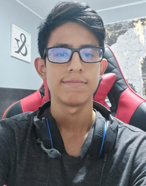

  

# Universidad Peruana de Ciencias Aplicadas
## Carrera de Ingeniería de Software

Carrera: Ingeniería de Software

Ciclo: 2024 - 2

Curso: Aplicaciones para Dispositivos Móviles

Sección: SW63

Profesor: Jorge Luis Mayta Guillermo

“Informe de Trabajo Final"

Startup: AgroTech

Producto: AgroSupport

|          Integrantes          |      Código      |
|:-----------------------------:|:-------------------:|
|   Paredes Puente, Sebastian Roberto  |    U202217239    |
|   Delgado Corrales, Piero Gonzalo   |    U202210749    |
|  Matos Fernandez, Christian Andre   |    U202214162    |
|  Salinas Torres, Salvador Antonio   |    U20221B127    |

Agosto 2024

# Registro de versiones

<table>
  <thead>
    <tr>
        <th>Versión</th>
        <th>Fecha</th>
        <th>Autor</th>
        <th>Descripción de modificación</th>
    </tr>
  </thead>
  <tbody>
  <tr>
      <td><strong>TB1</strong></td>
      <td>29 de agosto</td>
      <td>
        <ul>
          <li>Paredes Puente, Sebastian Roberto</li>
          <li>Delgado Corrales, Piero Gonzalo</li>
          <li>Matos Fernandez, Christian Andre</li>
          <li>Salinas Torres, Salvador Antonio</li>
        </ul>
      </td>
      <td>
        Se han incluído los siguientes capítulos:
        <ul>
          <li>Objetivos SMART</li>
          <li>Capítulo 1: Presentación</li>
          <li>Capítulo 2: Needfinding</li>
          <li>Capítulo 3: Arquitectura</li>
        </ul>
      </td>
  </tr>
  </tbody>
</table>

# Tabla de Contenido

[Registro de Versiones](#registro-de-versiones)

[Student Outcome](#student-outcome)

[Objetivos SMART](#objetivos-smart)

[Capítulo 1: Presentación](#Capítulo-I-Presentación)
  - [1.1. Startup Profile](#11-startup-profile)
    - [1.1.1. Descripción de la Startup](#111-descripción-de-la-startup)
    - [1.1.2. Perfiles de integrantes del equipo](#112-perfiles-de-integrantes-del-equipo)
  - [1.2. Solution Profile](#12-solution-profile)
    - [1.2.1. Antecedentes y problemática](#121-antecedentes-y-problemática)
    - [1.2.2. Lean UX Process](#122-lean-ux-process)
      - [1.2.2.1. Lean UX Problem Statements](#1221-lean-ux-problem-statements)
      - [1.2.2.2. Lean UX Assumptions](#1222-lean-ux-assumptions)
      - [1.2.2.3. Lean UX Hypothesis Statements](#1223-lean-ux-hypothesis-statements)
      - [1.2.2.4. Lean UX Canvas](#1224-lean-ux-canvas)
  - [1.3. Segmentos objetivo](#13-segmentos-objetivo)

[Capítulo 2: Needfinding](#Capítulo-2-Needfinding)
  - [2.1. Competidores](#21-competidores)
    - [2.1.1. Análisis competitivo](#211-análisis-competitivo)
    - [2.1.2. Estrategias y tácticas frente a competidores](#212-estrategias-y-tácticas-frente-a-competidores)
  - [2.2. Entrevistas](#22-entrevistas)
    - [2.2.1. Diseño de entrevistas](#221-diseño-de-entrevistas)
    - [2.2.2. Registro de entrevistas](#222-registro-de-entrevistas)
    - [2.2.3. Análisis de entrevistas](#223-análisis-de-entrevistas)
  - [2.3. Needfinding](#23-needfinding)
    - [2.3.1. User Personas](#231-user-personas)
    - [2.3.2. User Task Matrix](#232-user-task-matrix)
    - [2.3.3. User Journey Mapping](#233-user-journey-mapping)
    - [2.3.4. Empathy Mapping](#234-empathy-mapping)
    - [2.3.5. As-is Scenario Mapping](#235-as-is-scenario-mapping)
  - [2.4. Ubiquitous Language](#24-ubiquitous-language)

[Capítulo 3: Arquitectura](#Capítulo-3-Arquitectura)

[Capítulo 4: Backend Product Implementation & Validation](#Capítulo-4-Backend-Product-Implementation--Validation)

[Capítulo 5: Product Implementation & Validation](#Capítulo-5-Product-Implementation--Validation)

[Conclusiones](#conclusiones)

[Recomendaciones](#recomendaciones)

[Video App Validation](#video-app-validation)

[Video About the Product](#video-about-the-product)

[Video About the Team](#video-about-the-team)

[Glosario](#glosario)

[Bibliografía](#bibliografía)

# Student Outcome

**ABET – EAC - Student Outcome 7**

**Criterio:** La capacidad de adquirir y aplicar nuevos conocimientos según sea necesario, utilizando estrategias deaprendizaje apropiadas.

<table>
  <thead>
    <tr>
      <th><strong>Criterio específico</strong></th>
      <th><strong>Acciones realizadas</strong></th>
      <th><strong>Conclusiones</strong></th>
    </tr>
  </thead>
  <tbody>
    <tr>
      <td>Actualiza conceptos y conocimientos necesarios para su desarrollo profesional y en especial para su proyecto en soluciones de software.</td>
      <td>
        
<strong>Paredes Puente, Sebastian Roberto</strong>

        
<strong>TB1:</strong>

        

        
<strong>Delgado Corrales, Piero Gonzalo</strong>

        
<strong>TB1:</strong>

        

        
<strong>Matos Fernandez, Christian Andre</strong>

        
<strong>TB1:</strong>

        

        
<strong>Salinas Torres, Salvador Antonio</strong>

        
<strong>TB1:</strong>

        

      </td>
      <td>
        
<strong>TB1:</strong>

        

      </td>
    </tr>
    <tr>
      <td>Reconoce la necesidad del aprendizaje permanente para el desempeño profesional y el desarrollo de proyectos en soluciones de software.</td>
      <td>
        
<strong>Paredes Puente, Sebastian Roberto</strong>

        
<strong>TB1:</strong>

        

        
<strong>Delgado Corrales, Piero Gonzalo</strong>

        
<strong>TB1:</strong>

        

        
<strong>Matos Fernandez, Christian Andre</strong>

        
<strong>TB1:</strong>

        

        
<strong>Salinas Torres, Salvador Antonio</strong>

        
<strong>TB1:</strong>

        

      </td>
      <td>
        
<strong>TB1:</strong>

        

      </td>
    </tr>
  </tbody>
</table>

# Objetivos SMART

# Capítulo 1: Presentación

## 1.1. Startup Profile

### 1.1.1. Descripción de la Startup

**Misión:**

**Visión:**

### 1.1.2. Perfiles de integrantes del equipo

<table>
  <tr>
    <th>
      
    </th>
    <td valign="top">
      
<b>Paredes Puente, Sebastian Roberto</b>

      

        Soy estudiante de sexto ciclo de la carrera de Ingeniería de Software. Dentro de mi experiencia, destaco la capacidad de analizar información y programar en lenguaje C++. Además, he completado cursos en Python, SQL Server y HTML. En cuanto a mis habilidades interpersonales, cuento con adaptabilidad, pensamiento creativo, trabajo en equipo, gestión del tiempo y capacidad analítica para resolver problemas.
      

    </td>
  </tr>
  <tr>
    <th>
      
    </th>
    <td valign="top">
      
<b>Delgado Corrales, Piero Gonzalo</b>

      

        Actualmente estoy en el sexto ciclo de Ingeniería de Software. Poseo destrezas en programación en C++, así como conocimientos en estructuras de datos y sus aplicaciones. Recientemente, he adquirido habilidades en diseño web utilizando HTML, CSS y herramientas como Figma. Soy una persona responsable y me esfuerzo por mantener una organización óptima para gestionar eficazmente las entregas de trabajos.
      

    </td>
  </tr>
    <tr>
    <th>
      
    </th>
    <td valign="top">
      
<b>Matos Fernandez, Christian Andre</b>

      

        Me llamo Christian Matos, y estoy en mi sexto ciclo de Ingeniería de Software. Poseo experiencia en programación en lenguajes como Python, C++, y JavaScript. Disfruto contribuir con mis habilidades y trabajar en equipo para alcanzar nuestros objetivos comunes.
      

    </td>
  </tr>
  <tr>
    <th>
      
    </th>
    <td valign="top">
      
<b>Salinas Torres, Salvador Antonio</b>

      

        Soy estudiante de sexto ciclo de la carrera de Ingeniería de Software. Poseo conocimientos en programación orientada a objetos en C++, Python, C# y Java; desarrollo de Frontend con frameworks de Angular y Vue; gestión de base de datos en SQL Server, MySQL y SQLite. Considero que soy una persona responsable y siempre organizo el tiempo para hacerlos tranquilamente antes de la fecha de entrega.
      

    </td>
  </tr>
</table>

 

## 1.2. Solution Profile

### 1.2.1 Antecedentes y problemática

### 1.2.2 Lean UX Process.

#### 1.2.2.1. Lean UX Problem Statements.

#### 1.2.2.2. Lean UX Assumptions.

#### 1.2.2.3. Lean UX Hypothesis Statements.

#### 1.2.2.4. Lean UX Canvas.

## 1.3. Segmentos objetivo

# Capítulo 2: Needfinding

## 2.1. Competidores

### 2.1.1. Análisis competitivo

### 2.1.2. Estrategias y tácticas frente a competidores

## 2.2. Entrevistas

### 2.2.1. Diseño de entrevistas

### 2.2.2. Registro de entrevistas

### 2.2.3. Análisis de entrevistas

## 2.3. Needfinding

### 2.3.1. User Personas

### 2.3.2. User Task Matrix

### 2.3.3. User Journey Mapping

### 2.3.4. Empathy Mapping

### 2.3.5. As-is Scenario Mapping

# Capítulo 3: Arquitectura

# Capítulo 4: Backend Product Implementation & Validation

# Capítulo 5: Product Implementation & Validation

# Conclusiones

# Recomendaciones

# Video App Validation

# Video About the Product

# Video About the Team

# Glosario

# Bibliografía
